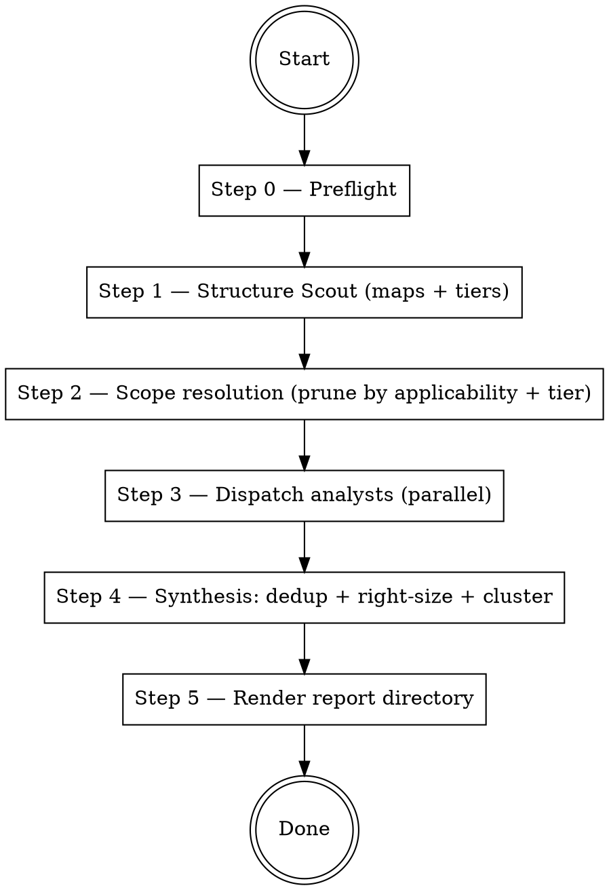

# Codebase Deep Analysis

## Overview

Dispatch parallel Explore subagents to analyze every **applicable** layer of the codebase — backend, frontend, tests, tooling, database, documentation, security — then synthesize findings into a **directory** of markdown files that a brainstorming session can consume one cluster at a time.

**The only writes permitted are to `docs/code-analysis/`** (the report directory and a scratch subdirectory). No code modifications. No running builds, tests, migrations, installs, or any subcommand that writes state. Read-only shell commands only.

**Two core principles, equally important:**

1. **Analyze everything, fix nothing.** Only suggest a fix when you can name the file, the line, and the replacement text.
2. **Right-size to the project.** A hobby tool does not get enterprise advice. Every analyst filters by the project's tier (T1 hobby / T2 serious-OSS / T3 prod-team); synthesis drops or rewrites findings whose canonical fix assumes infra, team, or process the project lacks. Inactionable noise is worse than a shorter report.

## References (load as needed)

| File | Purpose |
|------|---------|
| `references/structure-scout-prompt.md` | Prompt for the mapping pass, including **project tier** classification |
| `references/agent-roster.md` | Which analysts exist, what they own, when they run |
| `references/agent-prompt-template.md` | Template filled in per analyst; enforces ground rules + tier-sensitive finding format (adds `Autonomy:` and `Cluster hint:` fields) |
| `references/checklist.md` | Stable checklist IDs with min-tier tags and agent ownership |
| `references/synthesis.md` | Dedup, right-sizing filter, hybrid clustering, severity resolution, Executive Summary |
| `references/report-template.md` | Multi-file directory skeleton (README, exec summary, clusters, by-analyst, checklist, meta, not-in-scope) |

## Execution flow



## Step 0 — Preflight

1. **Token warning with a single ask.** Tell the user: *"This run dispatches several analyst subagents in parallel and will consume a large number of tokens. It is best run when weekly quota has spare headroom. Proceed?"* Use `AskUserQuestion` (or equivalent single prompt). If the user does not answer within a reasonable window, or answers no, abort with a short status message. Never block indefinitely.
2. **Check git state, but do not gate on it.** Run `git status --porcelain`. If output is non-empty, warn the user that any `file:line` references in the resulting report may shift if they later commit or revert. Do **not** abort — this skill is read-only and a dirty tree is not a safety issue.
3. **Pick a non-clobbering report directory.** Default: `docs/code-analysis/YYYY-MM-DD/`. If that directory already exists, use `YYYY-MM-DD-HHMMSS/` instead. Never overwrite a prior report directory.
4. **Create the directory skeleton,** empty — `clusters/`, `by-analyst/`, `.scratch/` — so later steps append into place.

## Step 1 — Structure Scout

Dispatch **one** Explore subagent with the prompt in `references/structure-scout-prompt.md`. Haiku is preferred for this pass; fall back to the default model if Haiku is unavailable.

The Scout's job is two things: (a) map the codebase; (b) **classify the project tier (T1 / T2 / T3)** with cited evidence. The tier is the single biggest right-sizing lever — it drives which analysts run, which checklist items are owned, and which findings survive synthesis.

Explore subagents cannot write files. When the Scout returns, **you** (the orchestrator) write its full output to `docs/code-analysis/{stem}/.scratch/codebase-map.md`. Analysts will Read that path; they will never receive the map pasted into their prompt.

If the repo has no `.git/`, the scout falls back to `rg --files --hidden --no-ignore-vcs` — specified inside the scout prompt file.

## Step 2 — Scope resolution

Read the scout's **Applicability flags** block and **Project tier** block.

- **Applicability pruning.** Drop analysts whose scope is absent: no web UI → skip Frontend; no DB → skip Database; no CI config → Tooling still runs (it owns BUILD/GIT even without CI) but its CI-specific items become `[-] N/A`.
- **Tier pruning.** Do not skip analysts based on tier — tier filtering happens per checklist-item inside each analyst, not at the roster level.

Record every skipped analyst and the reason — the final `README.md` must state this under Run metadata.

Exceptions that always run:

- **Security Analyst always runs.** Even a "pure backend library" can ship a subprocess call or deserialization surface.
- **Docs Analyst always runs** if any of `CLAUDE.md`, `AGENTS.md`, `GEMINI.md`, `README.md`, or `docs/**` exists.
- **Tooling Analyst always runs** unless the repo has literally no manifest/build config at all (rare; essentially `.txt` files only).

## Step 3 — Dispatch analysts (parallel)

Launch all remaining analysts **in a single message** using multiple `Agent` tool calls so they run concurrently. Each agent is an Explore subagent. Each prompt is assembled from `references/agent-prompt-template.md` with these substitutions:

- `{AGENT_NAME}`, `{SCOPE_GLOBS}` — from `references/agent-roster.md`
- `{CODEBASE_MAP_PATH}` — the scratch file you wrote in Step 1
- `{PROJECT_TIER}`, `{TIER_RATIONALE}` — copied from the Scout's Project-tier block
- `{OWNED_CHECKLIST_ITEMS}` — the subset of `references/checklist.md` this agent owns, with min-tier tags copied inline (the agent should not need to read the full checklist file)
- `{CLAUDE_MD_FILES}` — list of actual top-level instruction/doc files that exist (`CLAUDE.md`, `AGENTS.md`, `GEMINI.md`, `README.md`, `docs/*.md`)

Hard rules the template enforces (read it before editing):

- Every agent reads `CLAUDE.md` / `AGENTS.md` / `GEMINI.md` / top-level `docs/*.md` before reading any source file. Documented decisions are intentional unless the agent can show the doc itself is wrong.
- Every agent receives the **project tier** at the top of its prompt and must filter every owned checklist item and every finding against it. Inactionable-for-this-tier findings are dropped at source; the synthesis right-sizing filter is a second line of defense, not the primary one.
- Forbidden reads: `.env*`, `*.pem`, `*.key`, `*.pfx`, `*.p12`, anything under `secrets/`, `credentials/`, `.ssh/`. Describe existence, never contents. Do not quote any token that looks like a credential.
- Forbidden commands: `install`, `add`, `build`, `migrate`, `exec`, `test`, `run`, any package-manager subcommand that downloads or modifies, and any execution of project code. Allowed: `git log`, `git blame`, `git ls-files`, `rg`, `ls`, `wc`, and the Read tool.
- Every finding carries: `file:line`, Severity (Critical/High/Medium/Low), Confidence (Verified / Plausible / Speculative), Effort (Small/Medium/Large/Unknown), **Autonomy** (autofix-ready / needs-decision / needs-spec), **Cluster hint** (kebab slug). The `Fix:` line is written only when Confidence = Verified **and** the agent can name the exact replacement — otherwise the line is omitted.
- Every owned checklist item gets one of: `[x] <evidence pointer>`, `[x] clean — <what was sampled>`, `[-] N/A — <reason>`, `[?] inconclusive — <what was tried>`. Bare `[x]` is a defect.

## Step 4 — Synthesis

See `references/synthesis.md`. Summary of what happens here:

1. **Collect & dedup** by anchor; merge entries across agents.
2. **Right-sizing filter** (§3 — the most important step). Drop or rewrite findings whose canonical fix assumes infrastructure/team/process absent at the project's tier. Stylistic and rule-restatement findings also drop here. The filter activity is tallied and surfaced under Run metadata so under/over-filtering is visible.
3. **Resolve ownership collisions** for multi-owner checklist items.
4. **Promote cross-cutting themes** (≥3 files across ≥2 agents after right-sizing).
5. **Hybrid clustering** (§6). Seed clusters from analyst `Cluster hint:` labels, reshape to share files/subsystems, apply the soft cap of 5–10 findings per cluster (split at >12). Each cluster is a self-contained fix session.
6. **Executive Summary** selects up to 5 clusters by severity + confidence + spread/sensitivity.
7. **Validate checklist integrity**; defect-demote bare `[x]` and contradictory `[-] N/A`.
8. **Draft META-1 entries** — CLAUDE.md rules that would have prevented recurring finding shapes.
9. **Optional single targeted re-dispatch** if Executive Summary is thin or defects demand it.
10. **Freeze.** No further changes during rendering.

## Step 5 — Render report directory

Fill in the directory layout from `references/report-template.md`:

```
docs/code-analysis/{stem}/
├── README.md                    # index, metadata, token warning, tier
├── executive-summary.md         # top clusters
├── themes.md
├── clusters/{NN-slug}.md        # one file per cluster
├── by-analyst/{agent}.md        # analyst-native dumps
├── checklist.md                 # full checklist with defects
├── meta.md                      # META-1 drafts
├── not-in-scope.md              # filtered-out tally + structural exclusions
└── .scratch/codebase-map.md
```

Rendering is a pure pass from the frozen synthesized set. The only place rendering adds anything is the 2–3-sentence `Suggested session approach` block per cluster file.

At the top of `README.md`, repeat the Step 0 token-warning sentence verbatim so any follow-up brainstorming session re-confirms before burning more tokens.

## Model selection

Default every analyst to **Sonnet**. Escalations:

- **Security Analyst → Opus** by default (cross-cutting; high cost of missing a finding).
- **Any analyst whose declared scope exceeds ~50k LOC, or which returns >30 High/Critical findings in the first pass → re-dispatch that agent on Opus** for a second, deeper pass and merge outputs during synthesis.
- **Haiku** only for Structure Scout (and any pure enumeration helper you add later).

There is **no** "when unsure, pick the more powerful tier" override. Unsure stays Sonnet; synthesis escalates surgically rather than broadly.

## Common mistakes

- **Enterprise advice to a hobby repo.** The single biggest quality failure. If the project is T1, drop anything that assumes SLOs, observability infra, team process, security review pipelines, or release management. The right-sizing filter at §3 of synthesis is the backstop — but analysts should drop at source.
- **Modifying code.** Never. The only writes are the report directory and its scratch subdir.
- **Pasting the codebase map into every prompt.** Write it to scratch once, reference by path. Pasting multiplies token cost by N agents.
- **Re-reading the whole repo per agent.** Each agent stays inside its scope filter; cross-scope reads require a one-line justification on the finding that needed them.
- **Self-certifying a fix suggestion.** If you cannot name the file, line, and exact replacement text, the `Fix:` line is omitted — not paraphrased.
- **Ticking a checklist item with no evidence.** `[x]` without a file:line or an explicit "clean — <what was sampled>" / `[-] N/A — <reason>` is a defect; synthesis demotes it.
- **Trusting Scout's applicability or tier flags blindly.** If an analyst finds evidence that an applicability flag was wrong or the tier classification mismatches reality, it says so in its Summary; synthesis re-dispatches or re-tiers.
- **Cluster-hint sprawl.** If every finding has its own unique cluster hint, clustering collapses into one-finding-per-file and the multi-file report is useless. Keep hints to a small controlled vocabulary per run.
- **Quoting secrets.** Describe presence, never contents.
- **Running anything.** No `bun test`, no `npm run build`, no migrations, no scripts. Static reading only.
