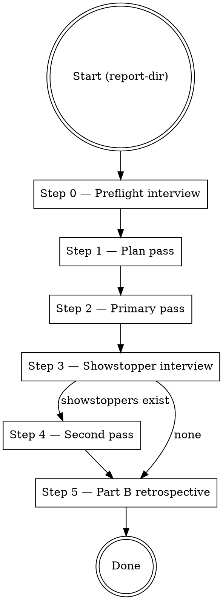

# implement-analysis-report Skill — Implementation Plan

> **For agentic workers:** REQUIRED SUB-SKILL: Use superpowers:subagent-driven-development (recommended) or superpowers:executing-plans to implement this plan task-by-task. Steps use checkbox (`- [ ]`) syntax for tracking.

**Goal:** Ship version 0.1.0 of the `implement-analysis-report` skill — a fix-coordinator counterpart to `codebase-deep-analysis` that consumes a cda report directory and lands the fixes in overnight-runnable passes.

**Architecture:** The skill is markdown documentation. One `SKILL.md` (the orchestrator entry point) + five reference files under `references/`. It's a thin wrapper over `superpowers:subagent-driven-development` — the per-cluster implementation engine — plus cda-specific logic: consolidated preflight interview, topological cluster ordering, verification gate execution, revert-on-failure + showstopper defer, `render-status.sh` invocation, Part B retrospective. No scripts, no executable code; all behavior is prose instructions to the orchestrator agent.

**Tech Stack:** Markdown, YAML frontmatter. Spec at `docs/specs/2026-04-21-implement-analysis-report-skill-design.md`. Target plugin: `plugins/codebase-deep-analysis/` (second skill alongside the existing one).

---

## File structure

**New files (all under `plugins/codebase-deep-analysis/skills/implement-analysis-report/`):**

- Create: `SKILL.md` — ~200 lines; entry point with execution flow, 6 numbered steps matching the spec, common mistakes, references table.
- Create: `VERSION` — single line, `0.1.0`.
- Create: `references/preflight-prompt.md` — ~120 lines; how the Step 0 consolidated `AskUserQuestion` is assembled, what decisions it captures, follow-up handling when the user edits preferences.
- Create: `references/cluster-subagent-prompt.md` — ~150 lines; wrapper prompt around `superpowers:subagent-driven-development`, slots for cluster body / decision answer / needs-spec text, output contract (no commits, no gates — orchestrator owns those choke points).
- Create: `references/showstopper-prompt.md` — ~80 lines; how the Step 3 consolidated `AskUserQuestion` is assembled per-showstopper, three canonical choices (`resolve` / `partial` / `defer`), timeout handling.
- Create: `references/gate-detection.md` — ~100 lines; how to detect `test` / `typecheck` / `lint` / `build` gates from `package.json` / `Makefile` / `justfile` / `Taskfile*` / `pyproject.toml`; per-cluster override semantics; timeout rules.
- Create: `references/partb-writer.md` — ~100 lines; how to fill the Part B section of `analysis-analysis.md` using cda's `analysis-analysis-template.md`; what data iar has collected during the run; anonymization contract.

**Modified files:**

- Modify: `plugins/codebase-deep-analysis/.claude-plugin/plugin.json` — bump plugin version to `3.2.0` (first minor release that adds a skill; semver convention for the plugin, independent of the individual skill version).

**Scope boundaries:** This plan does NOT modify any existing file under `skills/codebase-deep-analysis/`. The consumer relationship is one-way — iar reads cda's outputs, never edits cda's files.

---

## Task 0: Directory skeleton + VERSION

**Files:**
- Create: `plugins/codebase-deep-analysis/skills/implement-analysis-report/VERSION`

- [ ] **Step 1: Create skill directory**

```bash
mkdir -p /src/vibe/plugins/codebase-deep-analysis/skills/implement-analysis-report/references
```

- [ ] **Step 2: Write VERSION file**

File: `plugins/codebase-deep-analysis/skills/implement-analysis-report/VERSION`

```
0.1.0
```

- [ ] **Step 3: Verify layout**

Run: `ls -la /src/vibe/plugins/codebase-deep-analysis/skills/implement-analysis-report/`
Expected: `VERSION` visible; `references/` directory visible and empty.

- [ ] **Step 4: Commit**

```bash
cd /src/vibe
git add plugins/codebase-deep-analysis/skills/implement-analysis-report/
git commit -m "implement-analysis-report: skill skeleton (0.1.0)"
```

---

## Task 1: Write SKILL.md

**Files:**
- Create: `plugins/codebase-deep-analysis/skills/implement-analysis-report/SKILL.md`

The SKILL.md mirrors the structure of `codebase-deep-analysis/SKILL.md` so a reader familiar with cda can pattern-match on the fix-coordinator counterpart.

- [ ] **Step 1: Write SKILL.md with frontmatter + structure**

File: `plugins/codebase-deep-analysis/skills/implement-analysis-report/SKILL.md`

```markdown
---
name: implement-analysis-report
description: Use when the user has a codebase-deep-analysis report directory and wants to land the recommended fixes — consolidates every decision into a single preflight interview so the run can proceed unattended overnight, delegates per-cluster implementation to superpowers:subagent-driven-development, handles showstoppers in a second pass, writes Part B of the retrospective when done
---

# Implement Analysis Report

## Overview

Consume a `codebase-deep-analysis` report directory and land the fixes cluster-by-cluster. A single consolidated preflight interview captures every decision the run will need — cluster subset, `needs-decision` answers, `needs-spec` handling, branch strategy, verification gates, dry-run toggle. After that, Steps 1 through 5 proceed unattended. If showstoppers surface, they are batched into a single `AskUserQuestion` after the primary pass — the run pauses there but never mid-cluster.

**Two core principles, equally important:**

1. **Every user decision lands at preflight.** The skill never prompts mid-run. If ambiguity surfaces during implementation, the affected cluster defers to the showstopper list and the run continues.
2. **The skill delegates implementation.** Per-cluster code changes are the job of `superpowers:subagent-driven-development`. iar owns preflight, planning, gate execution, revert-on-failure, frontmatter updates, `render-status.sh` invocation, and Part B.

## References (load as needed)

| File | Purpose |
|------|---------|
| `references/preflight-prompt.md` | Step 0 consolidated `AskUserQuestion` template + follow-up handling |
| `references/cluster-subagent-prompt.md` | Wrapper around `superpowers:subagent-driven-development` per cluster |
| `references/showstopper-prompt.md` | Step 3 consolidated `AskUserQuestion` template |
| `references/gate-detection.md` | Auto-detect verification gates from common build-system manifests |
| `references/partb-writer.md` | How to fill Part B of `analysis-analysis.md` at run completion |
| `VERSION` | Skill version string (`0.1.0`) for retrospective identity |

## Compatibility

- Consumes `codebase-deep-analysis` output v3.0 or higher. Earlier report shapes lack the required cluster frontmatter fields (`Autonomy:`, `Pre-conditions:`, `informally-unblocks:`, `attribution:`). Abort at preflight with a clear message if the report is older.
- Requires `superpowers:subagent-driven-development` to be installed. If the skill is not discoverable via the harness's Skill tool, abort at preflight before any user interaction.

## Execution flow



## Step 0 — Preflight interview

See `references/preflight-prompt.md` for the full template. The step emits exactly one `AskUserQuestion` (plus at most one follow-up if the user picks `edit detected commands / gates first`). It captures:

- Cluster subset (`all` / `only: [slugs]` / `all-except: [slugs]`)
- One decision answer per `needs-decision` cluster in the subset
- Per `needs-spec` cluster: auto-defer to `docs/ideas/<slug>.md` (default) or free-text spec now
- Branch strategy: `new-branch` (default, `fix/deep-analysis-{YYYY-MM-DD}`) / `current-branch` / `worktree`
- Verification gates (auto-detected set, user-editable)
- Dry-run toggle (default off)
- Proceed / abort

On proceed, the skill records the decisions into its working memory and never prompts again until Step 3.

On abort (or no response within a reasonable window), exit cleanly.

## Step 1 — Plan pass

No user interaction. No code changes. The skill:

1. Parses every cluster file in the chosen subset. For each cluster extract: `Status`, `Autonomy`, `Depends-on`, `informally-unblocks`, `Pre-conditions`, `attribution`, per-cluster `gate:` override (if frontmatter carries one). Also parse TL;DR and Findings bodies.
2. Builds execution order. Topological sort on `Depends-on:` edges; within a level, cda's numeric prefix order from the filename. `informally-unblocks:` is logged but does not reorder. A cycle aborts with the cycle members listed.
3. Resolves `Pre-conditions:`. Any unmet pre-condition promotes the cluster directly to the showstopper list without attempting it.
4. Writes the plan to `{report-dir}/.scratch/implement-run.log` (JSON + human-readable summary).

## Step 2 — Primary pass

Sequential per cluster. For each cluster in plan order:

1. **Capture pre-cluster SHA** via `git rev-parse HEAD`.
2. **Dispatch per-cluster subagent** via `references/cluster-subagent-prompt.md`. The wrapper invokes `superpowers:subagent-driven-development` with cluster body + preflight-captured decision answer + needs-spec text (if any). The subagent produces code changes but does NOT commit and does NOT run gates.
3. **Run verification gates.** Per-cluster `gate:` frontmatter override wins; otherwise run the preflight baseline set. Gates timeout per `references/gate-detection.md`.
4. **On all gates passing:**
   - `git add -A`, commit with canonical message (`fix(cluster NN-slug, YYYY-MM-DD): {goal}`).
   - Commit message body includes `Incidental fixes:` section listing any files outside the cluster's named scope that were touched to pass gates, with one-line reasons from the subagent (per cda synthesis §12).
   - Flip cluster `Status: closed`, set `Resolved-in: <SHA>`.
   - Run `./scripts/render-status.sh .` from the report directory.
5. **On any gate failing OR subagent returning "cannot implement without further decision":**
   - `git reset --hard <pre-cluster-SHA>`.
   - Append `Deferred-reason:` line to the cluster frontmatter naming the failed gate (or subagent reason).
   - Add the cluster to the showstopper list with the gate's output excerpt (first 40 lines of stderr).
   - Continue with the next cluster.

If a cluster has `attribution: NN-slug (caught-by: ...)` in frontmatter, the commit message body names the attribution cluster but Status updates apply to THIS cluster only.

## Step 3 — Showstopper interview

If the showstopper list is empty, skip to Step 5.

Otherwise emit exactly one `AskUserQuestion` per `references/showstopper-prompt.md`. Per showstopper, three choices: `resolve: <free-text>` / `partial: <what was done>` / `defer: <reason>`.

If the user does not respond within a reasonable window, every showstopper is treated as `defer`. The run continues to Step 5.

## Step 4 — Second pass

Only handles clusters the user chose to `resolve` in Step 3. Execution matches Step 2 with the user's new input folded into the subagent prompt. No third pass — a cluster that fails its second attempt stays `partial` with `Resolved-in: (partial — second-pass gate '{X}' still failing)`.

## Step 5 — Part B retrospective

See `references/partb-writer.md`. Opens `{report-dir}/analysis-analysis.md`, locates the Part B section template left by cda Step 6, and fills it using the data collected during the run (cluster order attempted, outcomes, timings, showstoppers, incidentals, branch strategy, gate list). Anonymization matches cda's Part A contract.

## Model selection

Default orchestrator model: whichever Claude instance invokes the skill — no escalation rule. Per-cluster subagents inherit whatever `superpowers:subagent-driven-development` selects (typically Sonnet). Haiku is not used for implementation; the cost savings do not justify the lower reliability on code changes.

## Common mistakes

- **Prompting mid-run.** Step 0 captures every decision. Steps 1–5 must not call `AskUserQuestion`. If ambiguity surfaces, defer the cluster to the showstopper list — do not ask.
- **Running gates before the subagent has finished.** The orchestrator owns the gate choke point; the subagent produces code only. Running gates mid-subagent is a category error.
- **Committing on subagent failure.** `git reset --hard` is mandatory on gate failure. Leaving a failed cluster's changes in the tree poisons every subsequent cluster.
- **Editing cluster findings or bodies.** The cluster file is frozen input. Only `Status:`, `Autonomy:` (rarely), `Resolved-in:`, `Deferred-reason:` are writable from this skill.
- **Promoting a `needs-spec` cluster to `closed`.** `needs-spec` defaults to auto-defer to `docs/ideas/<slug>.md`. A subagent confident it can implement a `needs-spec` cluster without a spec is misreading the autonomy field.
- **Skipping `render-status.sh`.** Every Status flip re-runs the script. The README / REPORT.md index drifts otherwise.
- **Skipping Part B.** The retrospective is the mechanism by which iar evolves. An empty or boilerplate Part B is worse than none. Write specifics while they are fresh.
- **Running a second AskUserQuestion for gate overrides.** Gate overrides per cluster live in cluster frontmatter (`gate:` field), set during cda synthesis. If a gate override is missing, inherit the preflight baseline — do not re-ask.
- **Parallel cluster execution.** Clusters run strictly sequentially. Shared working tree semantics + `Depends-on:` edges make parallelism unsafe.

## Bookkeeping after the run

- Branch (or worktree) is left for the user to review, merge, or PR. The skill does not push.
- `{report-dir}/.scratch/implement-run.log` is retained — it is the primary raw input for the next iar version's RED-phase.
- Part B of `analysis-analysis.md` is written in place.
- Cluster frontmatter reflects final state. README / REPORT.md index is regenerated.
```

- [ ] **Step 2: Verify file**

Run: `wc -l /src/vibe/plugins/codebase-deep-analysis/skills/implement-analysis-report/SKILL.md`
Expected: 150–220 lines (around 180 is nominal).

- [ ] **Step 3: Commit**

```bash
cd /src/vibe
git add plugins/codebase-deep-analysis/skills/implement-analysis-report/SKILL.md
git commit -m "implement-analysis-report: SKILL.md entry point with 6-step flow"
```

---

## Task 2: Write preflight-prompt.md

**Files:**
- Create: `plugins/codebase-deep-analysis/skills/implement-analysis-report/references/preflight-prompt.md`

- [ ] **Step 1: Write the reference**

File: `plugins/codebase-deep-analysis/skills/implement-analysis-report/references/preflight-prompt.md`

```markdown
# Preflight prompt (Step 0)

The whole interaction with the user lives in this single step. One `AskUserQuestion` with every decision the run needs. At most one follow-up if the user picks `edit detected commands / gates first`. After that, Steps 1–5 proceed unattended.

## Data the orchestrator must collect before issuing the prompt

Gather these before the user sees anything — the prompt itself shows summarized values, not interactive detection.

1. **Report directory.** Either passed as the skill's argument or defaulted to the newest `docs/code-analysis/*/` directory. Verify it exists and contains a recognizable layout (`README.md` + `clusters/` dir, `REPORT.md` with `<!-- cluster:NN:start -->` markers, or `README.md` + no clusters — fail cleanly if none).
2. **cda version compatibility.** Read `{report-dir}/.scratch/codebase-map.md` first line or look for the v3+ frontmatter fields in any cluster (`Autonomy:`, `informally-unblocks:`). Abort with a clear message if the report predates v3.0.
3. **Dependencies installed.** Probe the harness for `superpowers:subagent-driven-development`. If not discoverable, abort before any user interaction.
4. **Cluster enumeration.** Walk every cluster (full-multi-file: `clusters/*.md`; compact-multi-file: same; single-file: parse `<!-- cluster:NN:start -->` / `<!-- cluster:NN:end -->` blocks from `REPORT.md`). For each cluster collect: slug, goal, Autonomy, Depends-on, informally-unblocks, Pre-conditions, per-cluster `gate:` override (if any), needs-decision question (from Suggested session approach block).
5. **Gate detection.** Read `package.json` scripts, top-level `Makefile`, `justfile`, `Taskfile*`, `pyproject.toml` `[tool.*.scripts]`. Build the baseline set per `gate-detection.md` rules.
6. **Current branch and working-tree state.** `git rev-parse --abbrev-ref HEAD`, `git status --porcelain`. Needed to surface warnings in the prompt (uncommitted changes + non-current-branch strategy = warning; uncommitted changes + current-branch strategy = warning; clean tree = no warning).

## Prompt structure

Issue exactly one `AskUserQuestion` with these sections:

```
Implement Analysis Report

Report: {report-dir}  (cda v{version}, {N} clusters)

== CLUSTER SUBSET ==
All clusters (default)
  [will process all {N} clusters in topological Depends-on order]
Only specific clusters
  [user lists slugs; the rest stay open]
All except specific clusters
  [user lists slugs to skip; the rest proceed]

== DECISIONS (needs-decision clusters in subset) ==
For each needs-decision cluster in the subset, show a question derived
from its Suggested session approach block, accept free-text answer:

  Cluster 04-auth-rewrite — [question from cluster body]
    Your answer: _____________
  Cluster 11-slider-refactor — [question from cluster body]
    Your answer: _____________
  ...

== NEEDS-SPEC HANDLING ==
For each needs-spec cluster in the subset:

  Cluster 02-webgl-harness — [default: auto-defer to docs/ideas/02-webgl-harness.md]
    Alternative: answer now with a free-text spec

== BRANCH STRATEGY ==
( ) New branch `fix/deep-analysis-{YYYY-MM-DD}`  (default)
( ) Current branch `{current-branch}`
( ) Git worktree (isolated; requires superpowers:using-git-worktrees)

== VERIFICATION GATES (auto-detected) ==
test:     `{detected-test-cmd}`    [edit] [remove]
typecheck: `{detected-tc-cmd}`     [edit] [remove]
lint:     `{detected-lint-cmd}`    [edit] [remove]
build:    `{detected-build-cmd}`   [edit] [remove]
[add custom gate]

== DRY RUN ==
( ) Off (default; commits land)
( ) On (validate flow; no commits, no frontmatter changes, log only)

== PROCEED ==
After answering, the run proceeds unattended through Steps 1–5.
The next user interaction is at Step 3 (showstoppers) if any arise.

( ) Proceed
( ) Edit detected commands / gates first
( ) Abort
```

## Handling `Edit detected commands / gates first`

Issue **one** follow-up `AskUserQuestion` with free-text slots for each editable gate command. Re-issue the primary prompt with the edited values so the user confirms the whole set with the corrections in view. Maximum two round-trips total. Never loop.

## Output capture

After the user's final answer, record a `PREFLIGHT_DECISIONS` object in working memory:

```
PREFLIGHT_DECISIONS = {
  "cluster_subset": "all" | "only: [slug, slug]" | "all-except: [slug, slug]",
  "decisions": {
    "04-auth-rewrite": "answer text",
    ...
  },
  "needs_spec_handling": {
    "02-webgl-harness": "auto-defer" | "spec: <free text>",
    ...
  },
  "branch_strategy": "new-branch" | "current-branch" | "worktree",
  "branch_name": "fix/deep-analysis-2026-04-21",  # derived when relevant
  "gates": {
    "test": "bun test",
    "typecheck": "tsc --noEmit",
    ...
  },
  "dry_run": false
}
```

Steps 1–5 read from this object exclusively. No re-detection. No re-parsing.

## Timeouts

If the user does not respond to the primary prompt, exit cleanly with a message: *"No preflight response; exiting without changes."* Do not proceed with defaults — unlike cda Step 3.5's "default to static-only", here the user has not even authorized the run.

## Common mistakes

- **Asking anything before detecting everything.** Do all detection first; the prompt shows a summary, not live questions.
- **Re-asking a decision mid-run.** Every `needs-decision` cluster's question lives here or nowhere.
- **Silently defaulting a branch on a dirty tree.** If the tree has uncommitted changes AND the user picks `current-branch`, show a warning line in the prompt and require explicit confirmation. Do not auto-stash.
```

- [ ] **Step 2: Commit**

```bash
cd /src/vibe
git add plugins/codebase-deep-analysis/skills/implement-analysis-report/references/preflight-prompt.md
git commit -m "implement-analysis-report: preflight prompt reference"
```

---

## Task 3: Write cluster-subagent-prompt.md

**Files:**
- Create: `plugins/codebase-deep-analysis/skills/implement-analysis-report/references/cluster-subagent-prompt.md`

- [ ] **Step 1: Write the reference**

File: `plugins/codebase-deep-analysis/skills/implement-analysis-report/references/cluster-subagent-prompt.md`

```markdown
# Cluster subagent prompt

One subagent dispatch per cluster. The subagent is a thin wrapper over `superpowers:subagent-driven-development` — that skill owns the TDD discipline, test scaffolding, and per-finding implementation loop. This wrapper adds cluster-specific context and the output contract that keeps the orchestrator in charge of gates and commits.

## Invocation

Dispatch the subagent with the skill invocation `superpowers:subagent-driven-development` and pass the prompt below. Substitute placeholders from working memory first.

Placeholders to fill:

- `{CLUSTER_FILE_PATH}` — absolute path to the cluster markdown file (or, in single-file mode, a virtual path that the orchestrator can produce as a temporary scratch file under `{report-dir}/.scratch/cluster-NN.md`)
- `{CLUSTER_SLUG}` — e.g., `04-auth-rewrite`
- `{CLUSTER_GOAL}` — from TL;DR
- `{DECISION_ANSWER}` — from `PREFLIGHT_DECISIONS.decisions[slug]` (empty string for autofix-ready clusters)
- `{NEEDS_SPEC_TEXT}` — from `PREFLIGHT_DECISIONS.needs_spec_handling[slug]` when value starts with `spec:` (empty otherwise)
- `{ATTRIBUTION_CLUSTER}` — from frontmatter `attribution:` (empty when absent)
- `{PROJECT_WORKING_TREE}` — absolute path to project root

## Prompt

```
You are a per-cluster implementation subagent. You implement the fixes named in the cluster file below. You do NOT commit, push, or run verification gates — the orchestrator owns those choke points.

## Your one job

Produce the code changes named in the cluster's Findings section. When done, return a summary of what you changed.

## Read these first

1. The cluster file: {CLUSTER_FILE_PATH}
   Attend to: TL;DR goal, Files touched, Severity & autonomy, Findings (every finding in order), Suggested session approach.
2. The project's CLAUDE.md / AGENTS.md / GEMINI.md / README.md if present at the project root.
3. Any file referenced by a finding's `Location:` line.

## Extra context from the run's preflight

- Cluster goal: {CLUSTER_GOAL}
- Cluster slug: {CLUSTER_SLUG}
- Decision answer (if the cluster is needs-decision): {DECISION_ANSWER}
- User-supplied spec (if the cluster is needs-spec and user answered now): {NEEDS_SPEC_TEXT}
- Attribution cluster (if this is a fuzz-gap cluster catching another cluster's bug): {ATTRIBUTION_CLUSTER}
- Project working tree: {PROJECT_WORKING_TREE}

If `DECISION_ANSWER` is non-empty, apply it verbatim — it is the user's preflight answer to the decision question in the cluster's Suggested session approach block.

If `NEEDS_SPEC_TEXT` is non-empty, treat it as the spec for this cluster. Do not ask the user questions — the orchestrator is unattended.

## What you do

- Use TDD per superpowers:subagent-driven-development — write failing test, implement, verify locally.
- Touch only what the findings justify, plus the minimum scope expansion needed to unblock a verification gate (per cda synthesis §12). Any expansion must be recorded (see Output contract below).
- Read before editing. Follow existing patterns.

## What you do NOT do

- Do NOT `git commit`. The orchestrator commits per cluster after gates pass.
- Do NOT run the project's full verification gates (test suite, typecheck, lint, build). Your local tests during TDD are fine; the project-level gates are the orchestrator's job.
- Do NOT `git push`, create branches, or touch git state beyond your own edits.
- Do NOT edit the cluster file itself. It is frozen input.
- Do NOT update frontmatter (Status, Resolved-in, etc.). That is the orchestrator's job.
- Do NOT ask the user questions. If you cannot proceed without a decision, return the `cannot-implement` output shape (below). The orchestrator will defer this cluster to the showstopper list.

## Output contract

Your final message must be exactly one of these shapes. No preamble, no trailing summary, no code blocks outside the structure.

### Shape A — Implementation complete

```
## Implementation complete

### Findings addressed
- {finding title 1}: {1-line description of the change}
- {finding title 2}: {1-line description of the change}
- …

### Files touched (cluster scope)
- `path/a.ts` (L{N}-{M}): {1-line reason}
- `path/b.ts` (new file): {1-line reason}

### Files touched (incidental scope expansion)
- `path/c.ts`: {1-line reason — why this was required to pass a gate; cda synthesis §12 shape}
- …
(Write `_none_` if no incidental files.)

### Ready for gates
Orchestrator should now run verification gates.
```

### Shape B — Cannot implement

```
## Cannot implement without further decision

### Reason
{1-3 sentences — what specifically was ambiguous or missing}

### What would unblock this
{1-3 sentences — the concrete piece of information the orchestrator could carry into a second-pass prompt}

### State of working tree
{"clean" if no edits made, or a list of files modified so far}
```

The orchestrator reads shape B as a showstopper and defers the cluster. Do not commit, do not clean up — the orchestrator will run `git reset --hard` to revert any in-progress edits.

## Anti-patterns in your own output

- **Self-certifying a fix.** Finding's `Fix:` line is a contract. If the existing code does not match what `Fix:` claims to replace (drift since the report was generated), return shape B — do not guess.
- **Batching across clusters.** Work only on this cluster. Do not touch files that belong to a different cluster's scope unless they are a §12 gate-unblock.
- **Pretending a needs-spec cluster is autofix-ready.** If `NEEDS_SPEC_TEXT` is empty AND the cluster's Autonomy is `needs-spec`, return shape B with reason "no spec supplied at preflight".
- **Ignoring the decision answer.** If `DECISION_ANSWER` is non-empty, the user chose that direction. Do not second-guess it.
```
```

- [ ] **Step 2: Commit**

```bash
cd /src/vibe
git add plugins/codebase-deep-analysis/skills/implement-analysis-report/references/cluster-subagent-prompt.md
git commit -m "implement-analysis-report: cluster subagent wrapper prompt"
```

---

## Task 4: Write showstopper-prompt.md

**Files:**
- Create: `plugins/codebase-deep-analysis/skills/implement-analysis-report/references/showstopper-prompt.md`

- [ ] **Step 1: Write the reference**

File: `plugins/codebase-deep-analysis/skills/implement-analysis-report/references/showstopper-prompt.md`

```markdown
# Showstopper prompt (Step 3)

After the primary pass, the orchestrator has a list of deferred clusters — each with a reason (`gate-failure:X`, `cannot-implement:Y`, `pre-condition-unmet:Z`, `frontmatter-parse-failure`). Step 3 batches them into exactly one `AskUserQuestion` so the user can resolve, accept-as-partial, or defer each.

If the list is empty, skip to Step 5.

## Data the orchestrator must have ready

For each showstopper:

- Cluster slug and goal
- Category: one of `gate-failure`, `cannot-implement`, `pre-condition-unmet`, `frontmatter-parse-failure`
- Detail line:
  - `gate-failure`: failed gate name + first 40 lines of stderr (the orchestrator captured this at Step 2)
  - `cannot-implement`: the subagent's "what would unblock this" paragraph
  - `pre-condition-unmet`: which pre-condition failed and why
  - `frontmatter-parse-failure`: the malformed field
- Attempted state: `reverted-to-pre-cluster-sha` (gate-failure or cannot-implement) or `not-attempted` (pre-condition-unmet or frontmatter-parse-failure)

## Prompt structure

```
Showstopper pass — {N} clusters need your input

The primary pass completed. These clusters were deferred. Pick one option
per cluster.

== Cluster 13-playwright-swap ==
Goal: Swap `bun test` for `bunx playwright test` in release workflow
Category: gate-failure
Detail: gate 'test' failed with
  > error: cannot find package '@playwright/test' at current Bun version
State: reverted to pre-cluster SHA

( ) Resolve with new input: _____________
    [Orchestrator will re-run the subagent with your text as additional
     context and retry the gates. No third pass — second-pass failure
     lands as partial.]
( ) Accept as partial: _____________
    [Mark Status: partial with your note. No further work. Useful when
     "we got one of the three findings done; the rest is blocked."]
( ) Defer whole: _____________
    [Mark Status: deferred with your reason. Optionally attach a
     docs/ideas/13-playwright-swap.md destination the orchestrator will
     pre-create.]

== Cluster 10-client-robustness ==
...

(Repeat per showstopper.)
```

## After the user answers

Record per cluster into working memory:

```
SHOWSTOPPER_ACTIONS = {
  "13-playwright-swap": {"action": "resolve", "input": "..."},
  "10-client-robustness": {"action": "partial", "note": "..."},
  "09-logger-migration": {"action": "defer", "reason": "...", "ideas_file": "docs/ideas/09-logger.md"},
  ...
}
```

Step 4 processes `resolve` entries. Every `partial` and `defer` is applied immediately: flip Status, set Resolved-in or Deferred-reason, run render-status.sh once at the end for the batch.

## Timeouts

If the user does not answer within a reasonable window, treat every showstopper as `defer: (no response — default defer)`. Continue to Step 5. Overnight-run contract means an unattended skill must finish, not block.

## Common mistakes

- **Asking more than once per cluster.** One `AskUserQuestion` covers all showstoppers. If the user's `resolve` input proves insufficient in the second pass, the cluster lands as `partial` — no third prompt.
- **Offering a 'retry unchanged' option.** A retry without new input would deterministically fail the same way. The three canonical choices are the only choices.
- **Running `render-status.sh` per-showstopper.** Batch the Status flips, run the script once.
- **Accepting empty free-text.** If the user picks `resolve` but the input is blank, treat it as `defer: (empty resolve input)`. Do not re-ask.
```

- [ ] **Step 2: Commit**

```bash
cd /src/vibe
git add plugins/codebase-deep-analysis/skills/implement-analysis-report/references/showstopper-prompt.md
git commit -m "implement-analysis-report: showstopper prompt reference"
```

---

## Task 5: Write gate-detection.md

**Files:**
- Create: `plugins/codebase-deep-analysis/skills/implement-analysis-report/references/gate-detection.md`

- [ ] **Step 1: Write the reference**

File: `plugins/codebase-deep-analysis/skills/implement-analysis-report/references/gate-detection.md`

```markdown
# Gate detection

How the orchestrator detects the verification gate set at preflight, and how per-cluster `gate:` frontmatter overrides interact with it.

## Baseline detection (run at preflight)

The baseline is the set of gates that run after every cluster commit unless a cluster's frontmatter overrides. Detect in this order; stop at the first hit per category.

### test

1. `package.json` scripts: exact key `test`, or keys matching `^test:.*` (e.g., `test:unit` is acceptable but prefer bare `test` if present).
2. `Makefile`: target `test` (look for `^test:` at start of line).
3. `justfile`: recipe `test`.
4. `Taskfile.yml` / `Taskfile.yaml`: task `test`.
5. `pyproject.toml` `[tool.poe.tasks]` / `[tool.pdm.scripts]` / equivalent: entry `test`.
6. `Cargo.toml` present → `cargo test`.
7. `go.mod` present → `go test ./...`.
8. None of the above → no `test` gate.

### typecheck

1. `package.json` scripts: keys matching `typecheck|tsc|check-types`.
2. `package.json` devDeps include `typescript` AND a `tsconfig.json` exists → fall back to `tsc --noEmit`.
3. `mypy` or `pyright` in `pyproject.toml` or `requirements-dev.txt` → `mypy` / `pyright` on the package root.
4. `Cargo.toml` present → `cargo check` (type + borrow checking).
5. None → no `typecheck` gate.

### lint

1. `package.json` scripts: keys matching `^lint$|^lint:.*`.
2. `eslint.config.*` or `.eslintrc*` present → `eslint .` (but prefer a configured script).
3. `.rubocop.yml` present → `rubocop`.
4. `pyproject.toml` `[tool.ruff]` or `[tool.flake8]` → the respective tool.
5. None → no `lint` gate.

### build

1. `package.json` scripts: key `build`.
2. `Makefile` target `build`.
3. `Cargo.toml` → `cargo build --release` only if the project has artifacts (an `[[bin]]` entry or a `Cargo.toml` at a workspace member with a `[lib]`).
4. None → no `build` gate.

## User editing at preflight

The preflight prompt (`preflight-prompt.md`) shows each detected command and lets the user edit or remove. An empty final set is allowed — the preflight shows a warning that clusters will close without gate enforcement, and the user must explicitly confirm.

## Per-cluster `gate:` frontmatter override

If a cluster's frontmatter has a `gate:` field, it replaces the baseline for that cluster. The override is a comma-separated list naming gates by key:

```
gate: test, typecheck
```

Missing gates (not listed) are skipped for that cluster. An empty override (`gate: `) means no gates at all for that cluster.

A cluster may also name a gate the baseline did not detect:

```
gate: test, custom:bun run coverage:check
```

The `custom:<cmd>` syntax adds an ad-hoc command. The orchestrator runs it with the same timeout rules as detected gates.

## Execution

For each gate in the active set:

1. Run the command from the project root. Capture stdout + stderr.
2. Exit code 0 → pass.
3. Non-zero exit → fail. Capture first 40 lines of stderr for the showstopper entry.

## Timeouts

Default per-gate timeout: 10 minutes.

Per-gate timeout override at preflight: the preflight prompt allows the user to set a custom timeout per gate (e.g., `build: 30 min` for a slow webpack build). Override lives in `PREFLIGHT_DECISIONS.gate_timeouts` keyed by gate name.

A gate that exceeds its timeout is killed (SIGTERM, then SIGKILL after 10 seconds grace) and treated as a failure.

## Common mistakes

- **Running all detected gates when only some are relevant.** If a cluster only touches CSS and the project has a test suite that doesn't cover CSS, running `test` for that cluster is wasted time. The cluster's frontmatter `gate:` override is the cleanest way to scope; absent that, the baseline runs.
- **Inventing gate commands.** If detection returns nothing for a category, leave it out. Don't default to `jest` or `mocha` or any framework the project does not declare.
- **Not capturing gate output on success.** The showstopper list only needs failed-gate output. Do not balloon the run log with passing-gate stdout.
- **Re-running a gate after an unchanged retry.** Second pass only runs gates if the subagent produced new edits. If the subagent returned shape B (`cannot implement`) in both passes, the cluster lands as `partial` without a second gate run.
```

- [ ] **Step 2: Commit**

```bash
cd /src/vibe
git add plugins/codebase-deep-analysis/skills/implement-analysis-report/references/gate-detection.md
git commit -m "implement-analysis-report: gate detection reference"
```

---

## Task 6: Write partb-writer.md

**Files:**
- Create: `plugins/codebase-deep-analysis/skills/implement-analysis-report/references/partb-writer.md`

- [ ] **Step 1: Write the reference**

File: `plugins/codebase-deep-analysis/skills/implement-analysis-report/references/partb-writer.md`

```markdown
# Part B writer (Step 5)

After Step 4 (or Step 3 if no showstoppers), iar writes Part B of `analysis-analysis.md` — the fix coordinator's retrospective. Same "write while memory is live" principle as cda's Part A: never defer.

## Audience and contract

The audience is **the author of the next version of iar** — a future Claude instance with no access to this report, this project, or this run's transcripts. Write directly to them.

Anonymization contract matches cda's Part A (see `codebase-deep-analysis/references/analysis-analysis-template.md` "Writing rules"):

- Name files *in the iar skill* (`SKILL.md` sections, reference filenames, cluster frontmatter fields) and quote template text verbatim.
- **Anonymize everything about the analyzed project.** No repo name, no real paths, no internal service names, no secrets. Replace with generic stand-ins that preserve shape (`module-A`, `the ORM layer`, `a T2 Python+TS web app`).
- Keep tier, stack family, rough size, counts, wall time — calibration signal, not identification.
- General advice ("be more specific") is useless. Anonymized-but-specific observations drive real improvements.

## Data iar has at write time

The orchestrator's working memory at Step 5 contains:

- `PREFLIGHT_DECISIONS` — every answer the user gave at Step 0.
- `PLAN` — cluster order, gate set, per-cluster gate overrides.
- `EXECUTION_LOG` — per-cluster: pre-SHA, outcome (closed/partial/deferred/showstopper/resolved-by-dep), wall time, gates run and their results, incidental files, subagent prompt + reply excerpts.
- `SHOWSTOPPER_LIST` and `SHOWSTOPPER_ACTIONS` — every deferred cluster and the user's Step 3 answer.
- `PARTB_START_SHA` and `PARTB_END_SHA` — first and last commit produced by the run.
- iar's own VERSION (`0.1.0`).
- cda's report version (from the report's metadata).

## Template to fill

Read `codebase-deep-analysis/references/analysis-analysis-template.md` and locate the Part B section. Fill it subsection by subsection. Do NOT skip subsections — a truthful "nothing notable here" is acceptable for a given subsection, but the heading must appear.

Subsections to fill (names verbatim from the template):

- Run identity (carry from Part A; add iar-specific rows: iar version, primary-pass wall time, second-pass wall time, gates run)
- Did the TL;DR block tell the truth? (evidence from EXECUTION_LOG)
- Cluster sizing honesty (compare Est. session size to actual wall time)
- Was the Suggested session approach useful?
- `Depends-on` edges in practice (did they hold? were any informally-unblocks edges load-bearing after all?)
- Scope-expansion events (every incidental-fix entry from EXECUTION_LOG)
- Deferred items (every showstopper that ended as `defer` or `partial`)
- Findings the report missed entirely (clusters whose fix surfaced bugs the analyst didn't flag)
- Findings the report had that didn't matter (e.g., an already-fixed flagged issue)
- Tooling reality (how gates behaved; any pinned-version surprises)
- Instructions to the v-next author (3–10 concrete items for the next iar version)

## Output location

Append to `{report-dir}/analysis-analysis.md`. The cda Step 6 template left a Part B section with placeholders; iar fills those placeholders in place. If no Part B section exists (older report), append a new `## Part B — Fix coordinator retrospective` section at the end of the file with a leading note that Part A was missing.

Part B is NOT under `.scratch/`. It sits next to Part A so anyone reviewing the report finds both retrospectives together.

## Common mistakes

- **Postponing.** By the time the next invocation rolls around, the details are gone. Write Part B immediately after the last cluster hits a terminal state.
- **Copying Part A's shape into Part B.** Part A is the runner retrospective (does synthesis over-filter?). Part B is the fix coordinator retrospective (did the cluster files tell the truth once we tried to implement them?). Different audiences, different questions.
- **Leaking project identity.** Even a throwaway code snippet can de-anonymize. When in doubt, replace with `<generic-shape>`.
- **Writing advice instead of evidence.** "Be more careful with autonomy flags" is useless. "Cluster 03 was marked autofix-ready but the third finding required deciding between two valid approaches; the subagent correctly returned shape B; v-next iar should prefer shape B more aggressively when the Fix: line uses hedging language" is useful.
```

- [ ] **Step 2: Commit**

```bash
cd /src/vibe
git add plugins/codebase-deep-analysis/skills/implement-analysis-report/references/partb-writer.md
git commit -m "implement-analysis-report: Part B writer reference"
```

---

## Task 7: Plugin manifest update

**Files:**
- Modify: `plugins/codebase-deep-analysis/.claude-plugin/plugin.json`

- [ ] **Step 1: Read current content**

Run: `cat /src/vibe/plugins/codebase-deep-analysis/.claude-plugin/plugin.json`
Expected: version `3.1.0`, description mentioning "three rendering modes".

- [ ] **Step 2: Bump version to 3.2.0, extend description**

File: `plugins/codebase-deep-analysis/.claude-plugin/plugin.json`

```json
{
  "name": "codebase-deep-analysis",
  "version": "3.2.0",
  "description": "Parallel-analyst deep analysis of an entire codebase, right-sized to the project's scale tier (T1/T2/T3). Produces a single-file, compact-multi-file, or full-multi-file report sized to finding density for cluster-by-cluster fix sessions. Ships with a companion implement-analysis-report skill that lands the fixes in overnight-runnable passes.",
  "author": {
    "name": "Per Wigren",
    "email": "per@wigren.eu"
  }
}
```

- [ ] **Step 3: Verify JSON validity**

Run: `python3 -c 'import json; json.load(open("/src/vibe/plugins/codebase-deep-analysis/.claude-plugin/plugin.json"))' && echo ok`
Expected: `ok`

- [ ] **Step 4: Commit**

```bash
cd /src/vibe
git add plugins/codebase-deep-analysis/.claude-plugin/plugin.json
git commit -m "plugin: 3.2.0 — add implement-analysis-report skill"
```

---

## Task 8: Smoke-test on a fabricated report

**Files:**
- Create: `/tmp/iar-smoke/` (throwaway)

Goal: exercise the skill's reading of a cda report-directory shape without actually dispatching subagents. Validates file structure, frontmatter expectations, and that the orchestrator's documented parsing (preflight-prompt.md §1.4) works against a minimal fixture.

- [ ] **Step 1: Set up fabricated report**

```bash
tmp=$(mktemp -d /tmp/iar-smoke-XXXX)
mkdir -p "$tmp/clusters"
mkdir -p "$tmp/scripts"
cp /src/vibe/plugins/codebase-deep-analysis/skills/codebase-deep-analysis/scripts/render-status.sh "$tmp/scripts/"
chmod +x "$tmp/scripts/render-status.sh"
cat > "$tmp/README.md" <<'EOF'
# Codebase Analysis — 2026-04-21

> **Heavy token usage.** …

## Project tier: T2

## Index

<!-- cluster-index:start -->
- [Cluster 01 — foo](./clusters/01-foo.md) — Fix the foo · **open** · autofix-ready
- [Cluster 02 — bar](./clusters/02-bar.md) — Decide the bar · **open** · needs-decision
- [Cluster 03 — baz](./clusters/03-baz.md) — Spec the baz · **open** · needs-spec
<!-- cluster-index:end -->
EOF
cat > "$tmp/clusters/01-foo.md" <<'EOF'
---
Status: open
Autonomy: autofix-ready
Resolved-in:
Depends-on:
informally-unblocks:
Pre-conditions:
attribution:
---

# Cluster 01 — foo

## TL;DR

- **Goal:** fix the foo
- **Impact:** foo works
- **Size:** Small
- **Depends on:** none
- **Severity:** Low
- **Autonomy (cluster level):** autofix-ready
EOF
cat > "$tmp/clusters/02-bar.md" <<'EOF'
---
Status: open
Autonomy: needs-decision
Resolved-in:
Depends-on: 01-foo
informally-unblocks:
Pre-conditions:
attribution:
---

# Cluster 02 — bar

## TL;DR

- **Goal:** decide the bar
- **Impact:** bar decided
- **Size:** Medium
- **Depends on:** cluster 01-foo
- **Severity:** Medium
- **Autonomy (cluster level):** needs-decision

## Suggested session approach

Question for maintainer: Do you want the bar to be X or Y?
EOF
cat > "$tmp/clusters/03-baz.md" <<'EOF'
---
Status: open
Autonomy: needs-spec
Resolved-in:
Depends-on:
informally-unblocks: 02-bar
Pre-conditions:
attribution:
---

# Cluster 03 — baz

## TL;DR

- **Goal:** spec the baz
- **Impact:** baz specced
- **Size:** Large
- **Depends on:** none
- **Severity:** Medium
- **Autonomy (cluster level):** needs-spec
EOF
echo "Fixture ready at $tmp"
```

- [ ] **Step 2: Verify render-status.sh runs against the fixture**

```bash
"$tmp/scripts/render-status.sh" "$tmp"
grep -A 3 'cluster-index:start' "$tmp/README.md"
```

Expected: index block shows all three clusters with correct Status and Autonomy columns, ordered `01-foo`, `02-bar`, `03-baz`.

- [ ] **Step 3: Manually walk the preflight-prompt.md detection steps against the fixture**

Simulate the orchestrator's detection pass (don't actually run iar — this is a spec-check):

```bash
# Cluster enumeration from clusters/*.md
ls "$tmp/clusters"

# Frontmatter extraction (awk lifted from render-status.sh)
for f in "$tmp/clusters/"*.md; do
  echo "=== $(basename $f) ==="
  awk '/^---$/{n++; next} n==1 {print}' "$f"
  echo
done
```

Expected: three clusters enumerated; each shows all seven frontmatter fields (`Status`, `Autonomy`, `Resolved-in`, `Depends-on`, `informally-unblocks`, `Pre-conditions`, `attribution`). Cluster 02 has `Depends-on: 01-foo`. Cluster 03 has `informally-unblocks: 02-bar`.

- [ ] **Step 4: Clean up**

```bash
rm -rf "$tmp"
```

- [ ] **Step 5: No commit — smoke test is local-only.**

---

## Task 9: Tag and release

**Files:**
- (none — git tag + push)

- [ ] **Step 1: Verify all commits present**

Run: `cd /src/vibe && git log --oneline -10`
Expected: seven iar commits in order (skeleton, SKILL.md, preflight, cluster-subagent, showstopper, gate-detection, partb), plus the plugin manifest bump.

- [ ] **Step 2: Create annotated tag**

```bash
cd /src/vibe
git tag -a implement-analysis-report-v0.1.0 -m "implement-analysis-report v0.1.0 — initial release"
```

- [ ] **Step 3: Push main and tag**

```bash
cd /src/vibe
git push origin main
git push origin implement-analysis-report-v0.1.0
```

Expected: both pushes succeed; remote accepts the new tag.

- [ ] **Step 4: Also bump + tag the plugin**

The plugin itself moved from `3.1.0` → `3.2.0` in Task 7. Tag that too for consumers who pin the plugin rather than individual skills.

```bash
cd /src/vibe
git tag -a codebase-deep-analysis-v3.2.0 -m "codebase-deep-analysis plugin v3.2.0 — adds implement-analysis-report skill"
git push origin codebase-deep-analysis-v3.2.0
```

---

## Post-implementation notes

1. The skill ships without end-to-end tests against real `superpowers:subagent-driven-development`. The RED-GREEN-REFACTOR testing described in `writing-skills` requires actual subagent dispatches, which is expensive and depends on the user's harness state. Task 8's smoke test is structural only. **The first real run (user invokes iar against a live cda report) is itself the integration test.** Capture what breaks in Part B of that run's retrospective; fold fixes into iar v0.2.0.

2. Three open questions from the spec (§11) are unresolved by this plan and should be closed in v0.2.0 based on first-run evidence:
   - How the cluster subagent wrapper discovers `superpowers:subagent-driven-development` — currently the skill assumes the Skill tool resolves `superpowers:subagent-driven-development` by name. Verify on first run.
   - What happens when superpowers is not installed — currently the skill aborts at preflight. Verify the error message is actionable.
   - Worktree cleanup on success — the skill leaves worktrees in place. User feedback will tell us whether auto-cleanup is wanted.

3. No CLAUDE.md changes. The skill's description is self-sufficient; no project-level rule is needed to make the skill discoverable.
