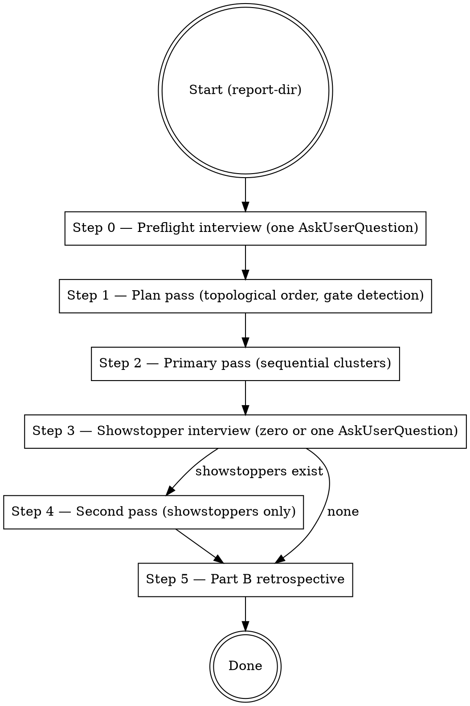

# implement-analysis-report — design

Design for a new skill that consumes a `codebase-deep-analysis` report directory and lands the fixes — unattended, overnight-runnable, with a single consolidated preflight interview. The fix-coordinator counterpart to the v3.1.0 analysis skill.

- **Status:** Draft for user review
- **Target plugin:** `codebase-deep-analysis` (second skill alongside the existing one)
- **Target skill version:** 0.1.0 (first release)
- **Consumes:** report directory emitted by `codebase-deep-analysis` v3.0+ (single-file, compact-multi-file, or full-multi-file mode)

---

## 1. Purpose

`codebase-deep-analysis` (cda) produces a report of clusters. Each cluster is a self-contained fix session. Today the user (or a future Claude instance) opens cluster files one by one and runs brainstorming sessions against them — the retrospective Part B template documents this flow.

`implement-analysis-report` (iar) automates that flow so the user can kick off fix work before bed and wake up to:

- a populated branch with commit-per-cluster
- cluster frontmatter reflecting actual state (`closed` / `partial` / `deferred` / `resolved-by-dep`)
- a regenerated README index
- a Part B retrospective written to `analysis-analysis.md`
- a second-pass showstopper list (single consolidated `AskUserQuestion`) for the handful of clusters that hit unresolvable ambiguity

## 2. Scope

**In scope:**

- Consolidated preflight interview (Q1 "a": batch every decision up front so the run is unattended).
- Per-cluster execution via a thin wrapper over `superpowers:subagent-driven-development` (Q4 "c").
- Strict `Depends-on:` topological ordering; within a level, cda's numeric prefix order.
- Verification gate execution (Q2 "d": auto-detected baseline + per-cluster frontmatter override).
- Auto-logged scope expansion per cda synthesis §12 (`Incidental fixes:` commit-message section).
- Revert-on-gate-failure + showstopper defer (Q5.5).
- Second-pass interview for showstoppers (Q5.7).
- Part B retrospective (Q5.8) at run completion.
- `render-status.sh` invocation after every status change (Q5.9).
- Branch / worktree management (Q3 "d": user-configurable, default `fix/deep-analysis-{YYYY-MM-DD}` branch).

**Out of scope:**

- Implementing the cluster work itself (delegated to `superpowers:subagent-driven-development`).
- Any work that isn't pointed at by a cluster (no refactor-as-we-go, no drive-by cleanups unless they are §12 `Incidental fixes`).
- Third-pass or beyond — if a cluster can't close after primary + showstopper passes, it stays `partial`.
- CI / PR creation — lands on a branch, user decides merge semantics.
- Multi-report execution (one report at a time).
- Editing the report's findings or clusters themselves (the skill is a consumer, not a second pass of synthesis).

## 3. Inputs and outputs

**Inputs:**

- A report directory emitted by cda (path passed to the skill; otherwise the skill defaults to the newest `docs/code-analysis/*/` directory).
- Project working tree.
- User interaction: exactly one preflight `AskUserQuestion`, exactly one (optional) showstopper `AskUserQuestion` after the primary pass.

**Outputs:**

- Commits on a branch (default `fix/deep-analysis-{YYYY-MM-DD}`, user-configurable).
- Updated cluster frontmatter: `Status`, `Autonomy` (rarely), `Resolved-in`, `Deferred-reason`.
- Regenerated cluster-index block in `README.md` / `REPORT.md`.
- Part B section appended to `analysis-analysis.md`.
- Optional `docs/ideas/<slug>.md` files for `needs-spec` clusters and partial deferrals.
- A run log at `{report-dir}/.scratch/implement-run.log` capturing: cluster order attempted, timings, gate results, showstopper list, final states.

## 4. Execution flow



### Step 0 — Preflight interview

Single consolidated `AskUserQuestion` (and at most one follow-up if the user picks "let me edit preferences"). Captures:

- **Cluster subset.** `all` (default) / `only: [slugs]` / `all-except: [slugs]`. The skill displays the list with Autonomy per cluster so the user can see shape before selecting.
- **Decision answers.** For every `needs-decision` cluster in the chosen subset, one question each derived from the cluster's `Suggested session approach` block. Answers captured into the working memory; per-cluster subagents receive their cluster's answers as extra prompt context.
- **`needs-spec` handling.** Per cluster: auto-defer to `docs/ideas/<slug>.md` (default) OR "answer now" (escalates to a free-text slot for the user's spec; subagent receives it). No third option.
- **Branch strategy.** `new-branch` (default, `fix/deep-analysis-{YYYY-MM-DD}`) / `current-branch` / `worktree` (requires `superpowers:using-git-worktrees`).
- **Verification gates.** Skill auto-detects `test`, `typecheck`, `lint`, `build` targets from `package.json` scripts / `Makefile` / `justfile` / `Taskfile*` / `pyproject.toml`. Shows detected set, asks user to confirm / edit. Empty set is allowed (skill warns that clusters will close without gate enforcement).
- **Dry-run toggle.** Default off. On: stays on the current branch (no branch / worktree creation), runs the preflight → plan → subagent → gate flow per cluster, but replaces `git commit` with `git stash && git stash drop` after gates pass, skips frontmatter flips and `render-status.sh`, and emits a preview report at `{report-dir}/.scratch/implement-run.log` naming each cluster's intended action (`would-close`, `would-defer`, `would-partial`). No writes to the report directory files other than the log. Intended for validating the flow without affecting any tracked artifact.
- **Proceed / abort.**

Design rule: if the user does not respond to the preflight, abort. The skill never blocks indefinitely, same as cda.

### Step 1 — Plan pass

No user interaction. No code changes. The skill:

1. Parses every cluster file in the chosen subset — frontmatter + TL;DR + Findings + Pre-conditions + Depends-on + informally-unblocks + attribution + Autonomy.
2. Builds the execution order: topological sort on `Depends-on:` edges; within a level, numeric prefix order from the filename. `informally-unblocks:` is logged but does not reorder. A cycle in `Depends-on:` aborts with a clear error naming the cycle members.
3. Resolves `Pre-conditions:` — for each cluster, confirms every referenced file / cluster is in the declared state. Any pre-condition that fails promotes the cluster to the showstopper list (no work attempted in primary pass).
4. Writes the plan to `{report-dir}/.scratch/implement-run.log` as JSON + human-readable summary.

### Step 2 — Primary pass

Sequential per cluster. For each cluster in the planned order:

1. **Capture pre-cluster SHA** via `git rev-parse HEAD`.
2. **Dispatch via `superpowers:subagent-driven-development`.** The wrapper loads that skill (reading `{SUPERPOWERS_DIR}/skills/subagent-driven-development/...`) and feeds it the cluster file + decision answers (from Step 0) + `needs-spec` free-text (if answered at preflight).
3. **Subagent implements.** Its job: produce the code changes for the cluster's findings. It does NOT run verification gates (the orchestrator owns that choke point) and does NOT commit.
4. **Run verification gates** — the cluster's declared gates (from frontmatter `gate:` field) override the preflight baseline. If no per-cluster override, run the baseline set.
5. **On all gates passing:** run `git add -A` on the subagent-touched paths + any `Incidental fixes` paths (tracked via `git diff --name-only` since pre-cluster SHA), commit with the canonical message shape (`fix(cluster NN-slug, YYYY-MM-DD): {goal}`), flip cluster `Status: closed`, set `Resolved-in: <SHA>`, run `./scripts/render-status.sh .`.
6. **On any gate failing:**
   - `git reset --hard <pre-cluster-SHA>` to wipe the attempt.
   - Record the failure: cluster slug, failed gate, captured output excerpt (first 40 lines of stderr).
   - Flip cluster `Status: open` (preserve original state if it wasn't `open`) and append `Deferred-reason: showstopper — gate '{X}' failed during primary pass (log: .scratch/implement-run.log#{N})` to frontmatter.
   - Add cluster + failure to the showstopper list.
   - Continue with the next cluster.
7. **On subagent returning "cannot implement without further decision":** same as (6) but with a different `Deferred-reason`.
8. **Scope expansion (§12 of cda synthesis).** The subagent may touch files beyond the cluster's named scope if a verification gate demands it. Those show up in `git diff --name-only`; the orchestrator classifies them as in-cluster (named in findings or Pre-conditions) vs. incidental, and writes the `Incidental fixes:` section in the commit message listing each incidental path with a one-line reason provided by the subagent. If the subagent cannot provide a reason, treat it as a showstopper.

Attribution handling (fuzz-gap convention, cda synthesis §6): if a cluster has `attribution: NN-slug (caught-by: ...)` in frontmatter, the commit message names the attribution cluster in the body but the Status update applies to THIS cluster only.

### Step 3 — Showstopper interview

If the showstopper list is empty, skip to Step 5.

Otherwise, issue exactly **one** `AskUserQuestion` listing every showstopper. Per showstopper:

- Cluster slug + goal
- Failure reason (gate name + output excerpt OR "subagent: cannot implement without further decision: {reason}")
- Three choices per showstopper:
  - **`resolve: <free-text>`** — user supplies the missing information or tweaked approach; skill retries in Step 4.
  - **`partial: <what was done>`** — user accepts what the primary pass produced (even if it was reverted); skill sets `Status: partial` with an explanatory `Resolved-in: (partial — <user's text>)`.
  - **`defer: <reason>`** — cluster deferred whole; optionally user can attach a `docs/ideas/<slug>.md` destination.

If the user does not respond to Step 3, the skill treats every showstopper as `defer` and continues. Overnight-run contract.

### Step 4 — Second pass

Only handles clusters the user chose to `resolve` in Step 3. Same execution as Step 2 with the user's new input folded into the subagent prompt. A cluster that fails its second attempt stays `partial` with `Resolved-in: (partial — second-pass gate '{X}' still failing)` — no third pass.

### Step 5 — Part B retrospective

Opens `{report-dir}/analysis-analysis.md`, locates the Part B section (empty template left by cda Step 6), and fills it using the template at `{cda-skill-dir}/references/analysis-analysis-template.md` "Part B — Fix coordinator retrospective". The orchestrator already has the data: cluster order attempted, outcomes, timings, showstopper list, incidental-fix surprises, branch strategy used, gate list used.

Same anonymization contract as Part A — name files *in the skill*, quote templates, record counts, but anonymize the project. The iar skill's own revision is captured alongside cda's revision in the Run identity block.

If the skill was run on a report where Part A does not exist (user ran an older cda version), Part B is still written with a leading note: *"Part A missing from this report; written in its absence. Runner context unknown."*

## 5. File layout

New skill directory:

```
plugins/codebase-deep-analysis/skills/implement-analysis-report/
├── SKILL.md
├── VERSION                              # 0.1.0
└── references/
    ├── preflight-prompt.md              # Template for the Step 0 AskUserQuestion (all options enumerated)
    ├── cluster-subagent-prompt.md       # Wrapper around subagent-driven-development; slots for cluster body + decision answer + needs-spec text
    ├── showstopper-prompt.md            # Template for the Step 3 AskUserQuestion
    ├── gate-detection.md                # How to detect verification gates from package.json / Makefile / justfile / etc.
    └── partb-writer.md                  # How to fill the Part B template; cross-reference to cda's analysis-analysis-template.md
```

No scripts directory — render-status.sh lives in the consumed report dir and is invoked by relative path per cluster.

## 6. Integration with codebase-deep-analysis

The skill reads but does not modify cda's outputs beyond the narrow set of fields documented as user-editable (cluster `Status`, `Resolved-in`, optional `Deferred-reason`). It respects the v3 cluster frontmatter schema verbatim — any field the skill doesn't understand is preserved untouched.

**Contract versioning:** iar declares a compatible cda version range in its `SKILL.md` frontmatter (`requires: codebase-deep-analysis >= 3.0.0, < 4.0.0`). A mismatched report version triggers a preflight abort with a clear error before any user interaction.

**Shared utilities:** iar calls `{report-dir}/scripts/render-status.sh` for every status-flip — the script is copied into the report dir at cda's Step 5. If the script is missing (e.g., report generated before v3.0), iar copies its own bundled copy from `{cda-skill-dir}/scripts/render-status.sh` into the report dir before running.

**cda updates for iar compatibility (if needed):** none planned. cda v3.1.0's outputs are already complete for the consumer.

## 7. Data flow

```
cluster file (YAML frontmatter + body)
  │
  ├─ frontmatter → orchestrator working memory (Status, Autonomy, Depends-on, Pre-conditions, gate, attribution)
  │
  └─ body → Step 0 preflight summary (for subset / decisions) AND Step 2 subagent prompt
                                                                    │
                                                                    ▼
                                              superpowers:subagent-driven-development
                                                                    │
                                                                    ▼
                                               code changes in working tree (no commit)
                                                                    │
                                                                    ▼
                                                     orchestrator runs gates
                                                         │            │
                                                         ▼            ▼
                                                       pass         fail
                                                         │            │
                                                         ▼            ▼
                                                      commit +     git reset +
                                                   update frontmatter     defer to showstopper
```

## 8. Error handling

- **Report directory missing or malformed** — abort at Step 0, before any interaction, with a message naming the first malformed cluster file.
- **Cluster frontmatter parse failure** — that cluster is skipped and added to the showstopper list as `malformed-frontmatter`. Remaining clusters proceed.
- **Depends-on cycle** — abort at Step 1 with the cycle members listed. User fixes the report and re-runs.
- **Branch creation failure** — exit at Step 0 immediately after the preflight answer with an actionable message (e.g., "uncommitted changes in tree prevent checkout; commit or stash, then re-run"). Not a prompt — the skill does not re-ask, the user fixes the environment and re-invokes.
- **Subagent timeout / error** — treat as `cannot implement without further decision`; defer as showstopper.
- **Gate command hangs** — orchestrator kills the gate after a per-gate timeout (default 10 min, configurable per gate at preflight). Timeout = gate failure → defer as showstopper.
- **Partial file write on `render-status.sh` failure** — orchestrator validates the index block was rewritten; on failure, logs the error, continues (the cluster's Status is still on disk and will re-render cleanly next invocation).
- **User revokes branch or stashes work mid-run** — not handled. Out-of-band interference voids the run; the skill detects the branch-head mismatch at the next commit attempt and aborts with a message naming the last successfully committed cluster.

## 9. Testing approach

Per `superpowers:writing-skills` RED-GREEN-REFACTOR:

**RED phase (baseline subagent pressure scenarios):**

- Scenario 1: give a fabricated 3-cluster report and dispatch a subagent WITHOUT the iar skill. Does it attempt all three in one pass without preflight? Does it commit per cluster or batch? Does it flip Status correctly?
- Scenario 2: fabricated cluster with a gate that fails; no iar skill. Does the subagent revert or leave the tree dirty? Does it try to close the cluster anyway?
- Scenario 3: fabricated showstopper (needs-decision cluster with unclear question). Does the subagent halt or guess?

Expected baseline failures: no preflight, no showstopper defer, no Part B retrospective.

**GREEN phase:** iar skill writes these behaviors explicitly. Re-run each scenario WITH iar; verify the three behaviors now hold.

**REFACTOR phase:** look for rationalizations in subagent transcripts ("I'll just try anyway", "this cluster's question is obvious", "I'll commit and fix next iteration"); plug with explicit counter-rules in `cluster-subagent-prompt.md` and `showstopper-prompt.md`.

**Static checks (pre-merge):**

- Preflight prompt has exactly one `AskUserQuestion` entry point (grep).
- Showstopper prompt has exactly one `AskUserQuestion` entry point.
- Cluster ordering logic passes: hand-crafted fixture with `Depends-on: 02-bar` on cluster 03 → plan order puts 02 before 03 regardless of numeric prefix.
- Integration: e2e run on a small fabricated report (3 clusters, 1 needs-decision, 1 autofix-ready, 1 needs-spec) in a git sandbox.

**Retrospective loop:** iar writes Part B every run. Future iar versions read the Part B sections across past runs as their own RED-phase input, same relationship as cda v3 to cda Part A.

## 10. Non-goals (explicit)

- Not a replacement for `superpowers:subagent-driven-development` — it's a thin wrapper.
- Not a PR opener or CI dispatcher.
- Not a report editor — finding / cluster bodies are frozen input.
- Not parallel — clusters run sequentially because `Depends-on:` edges and shared-working-tree semantics make parallelism unsafe.
- Not a brainstorming replacement for `needs-spec` clusters — the default is to auto-defer to `docs/ideas/`; the preflight "answer now" escape hatch is a free-text slot, not an interactive design session.

## 11. Open questions for user review

- **`SUPERPOWERS_DIR` discovery.** The cluster-subagent wrapper needs to locate `superpowers:subagent-driven-development`. Options: (a) invoke by skill-name via the harness's Skill tool; (b) resolve absolute path from known plugin-cache layout; (c) require the user to configure a path at preflight. Recommendation: (a), but it needs verification that the Skill tool is callable from within a dispatched subagent.
- **`SUPERPOWERS_DIR` availability.** What if the user doesn't have the superpowers plugin installed? Recommendation: preflight detects the skill; if missing, abort with a clear install instruction before any interaction.
- **Worktree cleanup.** If the user chose the worktree branch strategy and the run completes successfully, does iar clean up the worktree or leave it for the user to merge? Recommendation: leave it — the user explicitly chose isolation.
- **Multiple reports in same session.** If the user invokes iar twice in one session on different reports, does state leak? Recommendation: no global state; every run scopes its working memory to `{report-dir}`.
- **Naming: `implement-analysis-report` vs. `execute-analysis-report` vs. `cda-fix-coordinator`.** Recommendation: `implement-analysis-report` — matches the user's own phrasing ("implement the findings in the report in the way intended").

## 12. Success criteria

- A user can kick off iar against a freshly-generated cda report before bed and wake up to: a populated fix branch, closed/partial/deferred cluster states matching actual code state, a Part B retrospective, a regenerated README index, and at most one pending `AskUserQuestion` for any showstoppers that actually need user input.
- No clusters are silently skipped. Every cluster in the chosen subset reaches a terminal state (`closed` / `partial` / `deferred` / `resolved-by-dep`) or is on the showstopper list with a clear reason.
- No code modifications outside what the cluster findings + legitimate §12 scope expansion justify. Commit messages document every incidental file with a one-line reason.
- The skill integrates cleanly with `superpowers:subagent-driven-development` without duplicating its logic.
- Part B retrospectives accumulate over time as future-iar RED-phase input, completing the self-evolving loop.
