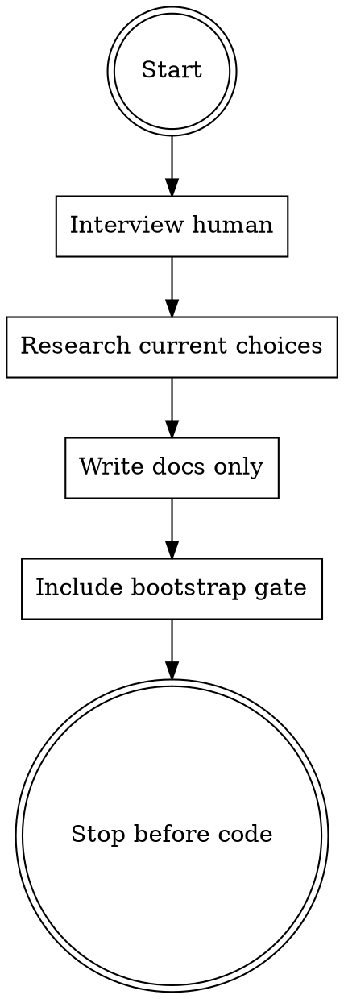

# Bootstrap Project

## Overview

Prepare a new project's instruction layer. Interview the human, research current stack choices, then write `AGENTS.md` and focused docs under `docs/` so a later agent can bootstrap the software correctly.

**This skill does not create application code, manifests, dependency files, CI, tests, or generated scaffolding.** It only writes project instructions and bootstrap documentation.

## Core Rule

The generated `AGENTS.md` must gate implementation with the exact command `bootstrap!`:

```md
## Bootstrap Gate

Do not create application code, manifests, dependency files, CI, tests, or generated scaffolding yet.

Wait until the human types exactly:

bootstrap!

Humans may edit AGENTS.md and docs/bootstrap/*.md before typing it. When bootstrap starts, follow the current edited documents.

When that happens, begin or resume docs/bootstrap/checklist.md. Keep this gate while the checklist is incomplete.

When the checklist is complete and local CI passes, replace this gate with:

## Bootstrap Status

Bootstrap is complete. Do not run bootstrap! again in this project.
```

Related phrases like "prepare", "plan", "set up docs", or "get ready" do not authorize code bootstrap.

## Flow



## Interview

Ask only for missing decisions that affect the docs. Prefer one compact consolidated question when the user already gave strong direction.

Capture:

| Area | Required decisions |
|------|--------------------|
| Product | purpose, users, non-goals, release target |
| Stack | language, runtime, UI targets, UI framework, major dependencies |
| Testing | unit framework, E2E framework, coverage gate, TDD expectations |
| Operations | logging levels, log files, API/command timing logs, secret handling |
| Workflow | branch model, commit policy, senior review before direct `main` commits and before merging to `main` |
| Docs | which role-specific docs belong under `docs/`, bug report flow, doc freshness rules |

If the user is unsure, record an open question instead of guessing. If a latest-stable component is chosen, instruct the future bootstrap agent to verify the current stable version with tools before using it.

## Technology Discovery

Do not choose language, runtime, UI framework, test framework, package manager, or major tooling from model memory. Use web search and/or MCP documentation searches before finalizing docs.

Record current sources in `docs/bootstrap/tooling.md`. Prefer official docs, release notes, package registries, project repositories, and ecosystem surveys with dates. Verify:

- stable release status
- active maintenance by more than one person or organization
- current popularity and ecosystem health
- fit for the human's stated and implied wishes
- idiomatic use in the selected language/runtime/framework

If the human names a preferred technology, verify it. If it appears stale, risky, or mismatched, explain the risk and ask before finalizing.

## Files to Write

Default output:

| File | Purpose |
|------|---------|
| `AGENTS.md` | Compact universal rules for all agents, optimized for weaker LLMs |
| `docs/bootstrap/plan.md` | Product intent, stack decisions, UI targets, major dependencies, open questions |
| `docs/bootstrap/tooling.md` | Source-backed technology choices, latest stable versions, package manager, formatter, linter, test framework, coverage tool, local CI command, `act` plan |
| `docs/bootstrap/checklist.md` | Rerunnable `bootstrap!` checklist with evidence for every completed item |
| `docs/bootstrap/engineering.md` | TDD, local CI, coverage, logging, comments, docs freshness, dependency freshness, idiomatic design, DRY, async, styling |
| `docs/bootstrap/review.md` | Senior review loop and main-branch protections |
| `docs/bugs/README.md` | Bug report and fixed-bug archive workflow |

`AGENTS.md` should contain only rules every agent must know. Put detailed role or workflow instructions in `docs/` and link to them from `AGENTS.md`.

## Required Project Rules

Encode these unless the human explicitly overrides them:

- Use latest stable versions for new components; verify with tools, do not guess.
- Do not over-engineer and do not under-engineer. Use the simplest idiomatic design that preserves correctness, testability, maintainability, and clear future change paths.
- Prefer the selected language's standard library and selected framework before adding dependencies or reimplementing built-in behavior.
- Ask for clarification when intent is unclear.
- Use RED/GREEN TDD from the first production line.
- Design for testability.
- Add an idiomatic local CI command before the first production line; it runs unit tests, formatting checks, linting, typecheck when applicable, and coverage. Do not include GitHub Actions, production binaries, or broad E2E runs unless the project explicitly chooses that.
- Add coverage checks at bootstrap; do not allow coverage percentages to decrease.
- Add DEBUG/INFO/WARN/ERROR file logging at bootstrap.
- Debug-log every incoming/outgoing API call and external command with roundtrip timing.
- Avoid polling, sleeping, and fixed waits. Prefer events, subscriptions, lifecycle hooks, promises, queues, observers, readiness signals, and framework-native async patterns.
- Do not use inline CSS/styles in HTML or components; put layout/design in CSS files or the selected framework's stylesheet mechanism.
- Remove duplicated logic when it represents the same concept and a shared implementation improves architecture or maintainability. Do not merge code only because it looks similar.
- Before fixing a bug, write a failing test that verifies it. If the bug cannot be verified, stop and ask.
- Comment files, classes, functions, methods, variables, and non-obvious blocks compactly; do not comment trivial code.
- Keep docs and comments current; stale docs/comments are bugs.
- Write clear commit messages: brief high-level imperative subject, body only when needed to explain why or verification.
- File unrelated bugs in `docs/bugs/` with known details only; do not investigate them during the current task.
- After fixing a bug from `docs/bugs/`, move it to `docs/bugs/fixed/`.
- Require senior code review for every direct commit to `main` and before merging any branch into `main`.
- Include `act` instructions in `docs/bootstrap/tooling.md` even if GitHub Actions are not initially chosen. Once GitHub Actions exist, installing/configuring `act` and verifying all locally testable workflows before push is mandatory; "`act` is not installed" is a bootstrap defect.

## AGENTS.md Pattern

Keep it short and directive:

```md
# AGENTS.md

## State

This repo is pre-bootstrap. Follow the Bootstrap Gate until the checklist is complete.

## Bootstrap Gate

Do not create code, manifests, dependency files, CI, tests, or scaffolding yet.

Wait until the human types exactly:

bootstrap!

Humans may edit AGENTS.md and docs/bootstrap/*.md before typing it. When bootstrap starts, follow the current edited documents.

When bootstrap! is typed, begin or resume docs/bootstrap/checklist.md. Keep this gate while the checklist is incomplete.

When the checklist is complete and local CI passes, replace this gate with:

## Bootstrap Status

Bootstrap is complete. Do not run bootstrap! again in this project.

## Always

- If intent is unclear, ask.
- Do not over-engineer or under-engineer; use idiomatic language/framework patterns.
- Use RED/GREEN TDD for implementation.
- Choose stack/tooling from current web/MCP research, not model memory.
- Prefer standard library/framework features before custom code or new dependencies.
- Avoid polling/sleeping; use proper async/events/readiness signals.
- Keep docs and comments current.
- Record unrelated bugs in docs/bugs/.
- Require senior review before direct main commits and before merging to main.

## Read Next

- docs/bootstrap/plan.md
- docs/bootstrap/tooling.md
- docs/bootstrap/checklist.md
- docs/bootstrap/engineering.md
- docs/bootstrap/review.md
- docs/bugs/README.md
```

## Common Mistakes

| Mistake | Fix |
|---------|-----|
| Creating source files or manifests | Delete them; this skill writes docs only |
| Using `bootstrap` instead of `bootstrap!` | The exact command is `bootstrap!` |
| Treating `bootstrap!` as one-shot before success | It may resume until `docs/bootstrap/checklist.md` is complete |
| Forgetting post-bootstrap status | Replace the gate with permanent "do not run bootstrap! again" status after success |
| Guessing latest versions | Write an instruction to verify current stable versions during real bootstrap |
| Choosing stack from memory | Run current web/MCP discovery and record sources in `docs/bootstrap/tooling.md` |
| Making local CI too broad | Local CI is unit tests, formatting, linting, typecheck when applicable, and coverage |
| Skipping `act` because GitHub Actions are deferred | Still document `act`; enforce once workflows exist |
| Putting all detail in `AGENTS.md` | Keep universal rules there; move detail to `docs/` |
| Treating tests-after as TDD | State RED/GREEN: failing test first, then implementation |
| Making review vague | Require senior review for direct `main` commits and branch merges to `main` |

## RED Findings

Baseline agents without this skill tended to scaffold code immediately, skip the interview, omit the gate-removal/status instruction, overload `AGENTS.md`, guess technologies from memory, hard-code non-idiomatic local CI command names, and broaden local CI into production builds or E2E. This skill exists to prevent those failures.
