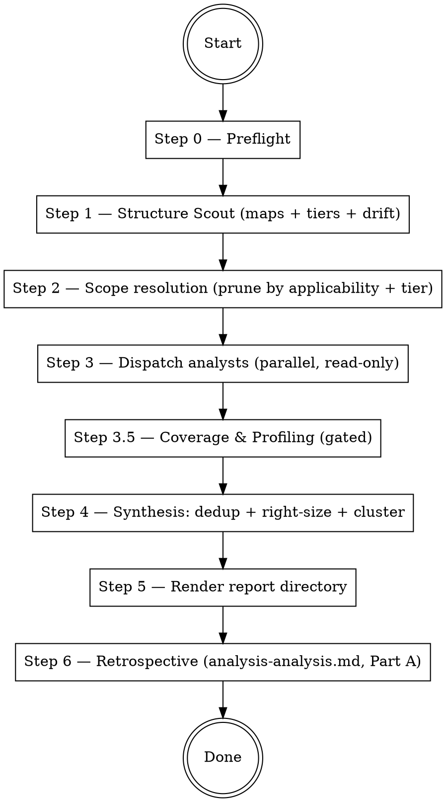

# Codebase Deep Analysis

## Overview

Dispatch parallel Explore subagents to analyze every **applicable** layer of the codebase — backend, frontend, tests, tooling, database, documentation, security — then synthesize findings into a **directory** of markdown files that a brainstorming session can consume one cluster at a time.

**The only writes permitted are to `docs/code-analysis/`** (the report directory and a scratch subdirectory). No code modifications. Read-only shell commands only, with **one carefully-bounded exception**: Step 3.5 may invoke the project's own existing coverage and bench commands if — and only if — the user grants a second explicit consent specifically for that step. Never run builds, migrations, installs, or any other subcommand that mutates state.

**Two core principles, equally important:**

1. **Analyze everything, fix nothing.** Only suggest a fix when you can name the file, the line, and the replacement text.
2. **Right-size to the project.** A hobby tool does not get enterprise advice. Every analyst filters by the project's tier (T1 hobby / T2 serious-OSS / T3 prod-team); synthesis drops or rewrites findings whose canonical fix assumes infra, team, or process the project lacks. Inactionable noise is worse than a shorter report.

## References (load as needed)

| File | Purpose |
|------|---------|
| `references/structure-scout-prompt.md` | Prompt for the mapping pass, including **project tier**, two-signal docs-drift flag, `ui-auth-gated` sub-flag, and pre-release-surface detection |
| `references/agent-roster.md` | Which analysts exist, what they own, when they run (including the gated Coverage & Profiling analyst); `scripts/` ownership rules |
| `references/analyst-ground-rules.md` | Ground rules every analyst reads at dispatch time: forbidden reads/commands, finding format, checklist line shapes, self-check rubric, tier-severity anchors, invocation verification. Read from the skill's `references/` at dispatch — not pasted into the prompt. |
| `references/agent-prompt-template.md` | Minimal per-agent wrapper (≤40 lines): scope, tier, owned-checklist, output contract. References `analyst-ground-rules.md` by path. |
| `references/checklist.md` | Stable checklist IDs with min-tier tags, agent ownership, and the full set of checklist-line shapes |
| `references/synthesis.md` | Dedup, right-sizing filter, hybrid clustering (incl. singleton floor, same-file split/merge, mechanical sanity check, fuzz attribution), severity resolution, Executive Summary, Depends-on handling, scope-expansion rules |
| `references/report-template.md` | Three rendering modes (single-file / compact multi-file / full multi-file) with cluster frontmatter schema (`Status:`, `Autonomy:`, `Resolved-in:`, `Depends-on:`, `informally-unblocks:`, `Pre-conditions:`, `attribution:`) |
| `references/coverage-profiling-prompt.md` | Prompt for the Step 3.5 gated analyst; static-only default, dynamic execution requires second user consent, user-override for detected command |
| `references/analysis-analysis-template.md` | Two-part retrospective template (runner + fix coordinator) written **to the next skill version's author** — primary RED-phase input for v-next |
| `scripts/render-status.sh` | Rebuilds the cluster-index block from each cluster's `Status:` / `Autonomy:` fields. Copied into the report directory at Step 5 so the fix coordinator can run it without the skill repo on disk. |
| `VERSION` | Stable skill version string; used by Step 6's revision-capture fallback chain when the skill is loaded from a plugin cache without `.git/`. |

## Execution flow

## Step 0 — Preflight

1. **Capture the skill's own revision up-front** (see Step 6 for the fallback chain). Keep the value in the orchestrator's working memory so it lands in `analysis-analysis.md` even if the skill repo becomes unavailable partway through.
2. **Load deferred tools.** `AskUserQuestion`, `TaskCreate`, and `TaskUpdate` may be deferred tools in your harness (visible by name in a `<system-reminder>` but not callable until their schemas load). If a tool call fails with `InputValidationError`, run `ToolSearch` with `select:AskUserQuestion,TaskCreate,TaskUpdate` first, then retry. This is cheap and saves a round-trip at the consent prompt.
3. **Token warning with a single ask.** Tell the user: *"This run dispatches several analyst subagents in parallel and will consume a large number of tokens. It is best run when weekly quota has spare headroom. The skill will auto-detect coverage/bench commands in Step 3.5 but will confirm with you before running them — if the detected command is wrong, you can correct it at the consent prompt. Proceed?"* Use `AskUserQuestion` (or equivalent single prompt). If the user does not answer within a reasonable window, or answers no, abort with a short status message. Never block indefinitely.
4. **Check git state, but do not gate on it.** Run `git status --porcelain`. If output is non-empty, warn the user that any `file:line` references in the resulting report may shift if they later commit or revert. Do **not** abort — this skill is read-only and a dirty tree is not a safety issue.
5. **Pick a non-clobbering report directory.** Default: `docs/code-analysis/YYYY-MM-DD/`. If that directory already exists, use `YYYY-MM-DD-HHMMSS/` instead. Never overwrite a prior report directory.
6. **Create the directory skeleton,** empty. Include `.scratch/` always; include `clusters/` and `by-analyst/` only if you already know you'll render in full multi-file mode (otherwise wait until Step 5, when synthesis's finding count reveals the rendering mode). The `scripts/` subdirectory is created at Step 5 rendering time with `render-status.sh` copied in.

## Step 1 — Structure Scout

Dispatch **one** Explore subagent with the prompt in `references/structure-scout-prompt.md`. Haiku is preferred for this pass; fall back to the default model if Haiku is unavailable.

The Scout's job is four things: (a) map the codebase; (b) **classify the project tier (T1 / T2 / T3)** with cited evidence; (c) flag **load-bearing instruction-file drift** (CLAUDE.md / AGENTS.md / GEMINI.md / README.md that have fallen behind the code they reference); (d) detect the **pre-release verification surface** (CI config + local CI-equivalent runner). The tier is the single biggest right-sizing lever — it drives which analysts run, which checklist items are owned, and which findings survive synthesis. The drift flag tells the Docs analyst where to look hardest. The pre-release surface controls whether the final README emits a release checklist.

Explore subagents cannot write files. When the Scout returns, **you** (the orchestrator) write its full output to `docs/code-analysis/{stem}/.scratch/codebase-map.md`. Analysts will Read that path; they will never receive the map pasted into their prompt.

If the repo has no `.git/`, the scout falls back to `rg --files --hidden --no-ignore-vcs` — specified inside the scout prompt file.

## Step 2 — Scope resolution

Read the scout's **Applicability flags** block and **Project tier** block.

- **Applicability pruning.** Drop analysts whose scope is absent: no web UI → skip Frontend; no DB → skip Database; no CI config → Tooling still runs (it owns BUILD/GIT even without CI) but its CI-specific items become `[-] N/A`.
- **Tier pruning.** Do not skip analysts based on tier — tier filtering happens per checklist-item inside each analyst, not at the roster level.

Record every skipped analyst and the reason — the final `README.md` must state this under Run metadata.

Exceptions that always run:

- **Security Analyst always runs.** Even a "pure backend library" can ship a subprocess call or deserialization surface.
- **Docs Analyst always runs** if any of `CLAUDE.md`, `AGENTS.md`, `GEMINI.md`, `README.md`, or `docs/**` exists.
- **Tooling Analyst always runs** unless the repo has literally no manifest/build config at all (rare; essentially `.txt` files only).

## Step 3 — Dispatch analysts (parallel)

Launch all remaining analysts **in a single message** using multiple `Agent` tool calls so they run concurrently. Each agent is an Explore subagent. Each prompt is assembled from `references/agent-prompt-template.md` (the wrapper) with these substitutions:

- `{SKILL_DIR}` — absolute path to this skill's root directory. The wrapper tells each agent to Read `{SKILL_DIR}/references/analyst-ground-rules.md` before anything else; that is where the full ground rules, finding format, line-shape rules, self-check rubric, and tier-severity anchors live. Ground rules are read from disk per agent, not pasted into the prompt — this halves dispatch tokens.
- `{AGENT_NAME}`, `{SCOPE_GLOBS}` — from `references/agent-roster.md`
- `{CODEBASE_MAP_PATH}` — the scratch file you wrote in Step 1
- `{PROJECT_TIER}`, `{TIER_RATIONALE}` — copied from the Scout's Project-tier block
- `{OWNED_CHECKLIST_ITEMS}` — the subset of `references/checklist.md` this agent owns, with min-tier tags copied inline (the agent should not need to read the full checklist file)
- `{CLAUDE_MD_FILES}` — list of actual top-level instruction/doc files that exist (`CLAUDE.md`, `AGENTS.md`, `GEMINI.md`, `README.md`, `docs/*.md`)
- `{APPLICABILITY_FLAGS}` — Scout's applicability flags block (including sub-flags like `web-facing-ui: present, auth-gated`). Analysts key default N/A behaviors off these.

Hard rules the wrapper + ground rules enforce (read both before editing):

- Every agent reads `CLAUDE.md` / `AGENTS.md` / `GEMINI.md` / top-level `docs/*.md` before reading any source file. Documented decisions are intentional unless the agent can show the doc itself is wrong.
- Every agent receives the **project tier** at the top of its prompt and must filter every owned checklist item and every finding against it. Inactionable-for-this-tier findings are dropped at source; the synthesis right-sizing filter is a second line of defense, not the primary one.
- Forbidden reads: `.env*`, `*.pem`, `*.key`, `*.pfx`, `*.p12`, anything under `secrets/`, `credentials/`, `.ssh/`. Describe existence, never contents. Do not quote any token that looks like a credential.
- Forbidden commands: `install`, `add`, `build`, `migrate`, `exec`, `test`, `run`, any package-manager subcommand that downloads or modifies, and any execution of project code. Allowed: `git log`, `git blame`, `git ls-files`, `rg`, `ls`, `wc`, and the Read tool.
- Every finding carries: `file:line`, Severity (Critical/High/Medium/Low), Confidence (Verified / Plausible / Speculative), Effort (Small/Medium/Large/Unknown), **Autonomy** (autofix-ready / needs-decision / needs-spec), **Cluster hint** (kebab slug). The `Fix:` line is written only when Confidence = Verified **and** the agent can name the exact replacement — otherwise the line is omitted.
- `Fix:` lines recommending a tool invocation (`bunx X`, `pnpm X`, `cargo X --flag`) must verify against the project's pinned toolchain (`.bun-version`, `.nvmrc`, `rust-toolchain.toml`, `.tool-versions`, `package.json#packageManager`). If the pin predates the invocation's availability or is not verifiable, Confidence downgrades to `Plausible` and the finding cannot be `autofix-ready`.
- Every owned checklist item gets one of five canonical line shapes: `[x] <evidence pointer>`, `[x] clean — <what was sampled or why absence is fine for tier>`, `[-] N/A — <reason>`, `[?] inconclusive — <what was tried>`, `[~] deferred — <reason + tracking>`. Bare `[x]` is a defect. Table-form checklists are a defect (`| Item | Status | ... |` rows are rejected wholesale; see synthesis §8).

## Step 3.5 — Coverage & Profiling (gated, optional)

This is the **only** step in the skill that may invoke project commands. It runs only when the user grants a second, explicit consent — do not roll it into Step 0's blanket approval.

1. **Detect candidates without running anything.** Read `package.json` scripts, top-level `Makefile`, `justfile`, `Taskfile*`, `pyproject.toml`'s `[tool.*.scripts]` equivalents. Identify the coverage command (names containing `cov`, `coverage`, or a test runner flag like `--coverage`) and the bench/profile command (names containing `bench`, `benchmark`, `profile`). There may be zero, one, or both.
2. **Ask once, with override option.** Use `AskUserQuestion` with the detected commands laid out plainly. Example: *"Step 3.5 can run the project's own coverage (`{cmd}`) and benchmarks (`{cmd}`) and fold the results into the report. This executes project code — unlike every other step in this skill. Proceed? [Run both with these / Run coverage only / Run bench only / Static-only / Skip / **Correct commands first**]"* If the user chooses `Correct commands first`, re-prompt with free-text override slots for each command; then re-issue the consent prompt with the corrected values. Do not block indefinitely; default to **Static-only** if the user does not answer in a reasonable window.
3. **Dispatch the Coverage & Profiling analyst** with the prompt in `references/coverage-profiling-prompt.md`. Pass `{EXECUTION_CONSENT}` = `granted` or `declined`; pass `{DETECTED_COVERAGE_CMD}` and `{DETECTED_BENCH_CMD}` as one of `auto-detected:<cmd>`, `user-corrected:<cmd>`, or `none-detected`. The analyst records the provenance in its metadata line so synthesis can show whether the user corrected detection. The analyst is the single choke point for runtime invocation: the orchestrator does not run anything itself.
4. **Merge output into synthesis.** The analyst's findings and checklist lines flow through Step 4 the same way as every other analyst — the only novelty is the optional dynamic-pass Confidence upgrade from Plausible to Verified on covered items.

If the user chose **Skip**, omit the analyst entirely and record `Coverage & Profiling: skipped (user declined)` in Run metadata. The analyst is not silent on decline — static-only is its default mode.

## Step 4 — Synthesis

See `references/synthesis.md`. Summary of what happens here:

1. **Collect & dedup** by anchor; merge entries across agents.
2. **Right-sizing filter** (§3 — the most important step). Drop or rewrite findings whose canonical fix assumes infrastructure/team/process absent at the project's tier. Stylistic and rule-restatement findings also drop here. The filter activity is tallied and surfaced under Run metadata so under/over-filtering is visible.
3. **Resolve ownership collisions** for multi-owner checklist items.
4. **Promote cross-cutting themes** (≥3 files across ≥2 agents after right-sizing).
5. **Hybrid clustering** (§6). Seed clusters from analyst `Cluster hint:` labels, reshape to share files/subsystems, apply the soft cap of 5–10 findings per cluster (split at >12). Each cluster is a self-contained fix session.
6. **Executive Summary** selects up to 5 clusters by severity + confidence + spread/sensitivity.
7. **Validate checklist integrity**; defect-demote bare `[x]` and contradictory `[-] N/A`.
8. **Draft META-1 entries** — CLAUDE.md rules that would have prevented recurring finding shapes.
9. **Optional single targeted re-dispatch** if Executive Summary is thin or defects demand it.
10. **Freeze.** No further changes during rendering.

## Step 5 — Render report directory

1. **Pick the rendering mode** from total finding count (post-synthesis §3 right-sizing) and tier:
   - `total findings < 15` AND tier ∈ {T1, T2} → **single-file** mode. One `REPORT.md` holds everything; cluster frontmatter lives in HTML-comment blocks inside the file so `render-status.sh` can still read and rewrite it.
   - `15 ≤ total findings < 60` AND tier ∈ {T1, T2} → **compact multi-file** mode. Full layout below, but `by-analyst/` collapses to a single `by-analyst.md`.
   - `total findings ≥ 60` OR tier = T3 → **full multi-file** mode. Directory of files per `references/report-template.md`.

2. **Fill the layout** for the chosen mode per `references/report-template.md`. Cluster frontmatter (all modes) carries:
   - `Status: open`
   - `Autonomy: <weakest-constituent>` — `needs-spec` > `needs-decision` > `autofix-ready`
   - empty `Resolved-in:`
   - `Depends-on:` / `informally-unblocks:` / `Pre-conditions:` / `attribution:` populated by synthesis where applicable

3. **Copy `scripts/render-status.sh` into `{report-dir}/scripts/render-status.sh`** (chmod +x). This makes the report directory self-contained — the fix coordinator can run `./scripts/render-status.sh .` from inside the report dir without the skill repo on disk. All three modes do this copy.

4. **Insert cluster-index markers.** Multi-file modes: the README's index block is bracketed by `<!-- cluster-index:start -->` / `<!-- cluster-index:end -->`. Single-file mode: same markers inside `REPORT.md`, plus each cluster's body is bracketed by `<!-- cluster:NN:start -->` / `<!-- cluster:NN:end -->` with frontmatter inside an HTML comment so `render-status.sh` can read Status / Autonomy / Resolved-in.

5. **Repeat the Step 0 token-warning sentence** verbatim at the top of the report so any follow-up brainstorming session re-confirms before burning more tokens.

Rendering is a pure pass from the frozen synthesized set. The only place rendering adds content is the 2–3-sentence `Suggested session approach` block per cluster (which may include a concrete implementation sketch for mechanical-autofix clusters per synthesis §6) and, conditionally, the `## Pre-release verification checklist` block when the Scout's `Pre-release surface` section recommended it.

## Bookkeeping after the report lands

The report is a living artifact. The fields the user is expected to edit by hand after rendering all live in cluster frontmatter:

- Flip `Status:` when work begins (`in-progress`), merges (`closed`), is partially resolved (`partial`), is punted whole (`deferred`), or is resolved incidentally by another cluster (`resolved-by-dep`).
- Fill `Resolved-in:` with the commit SHA or release tag that resolved the cluster. For `partial`, use form `SHA (partial — <blocker>)` — e.g., `SHA (partial — bunx playwright blocked on Bun 1.4)`.
- Update `Autonomy:` only if it changes materially during fix work (rare — usually the synthesis-assigned value holds).
- After any edit, from inside the report directory run `./scripts/render-status.sh .` to rebuild the index block. **Do not hand-edit the index** — it will drift from the cluster files immediately. The script was copied into the report directory at Step 5 so you do not need the skill repo on disk.
- When the last cluster closes, defers, or stalls, append **Part B** of `analysis-analysis.md` per `references/analysis-analysis-template.md`. Part B is the fix coordinator's retrospective; it is the second half of the input the v-next author needs, and nobody else is positioned to write it. If fix work is ongoing at the next invocation of the skill on this repo, write what you have so far and mark the rest open.

### Deferring shaped work

Findings that synthesis keeps but the maintainer chooses not to schedule during fix work land in `docs/ideas/<slug>.md` (a maintainer-owned directory, separate from the report directory's retention model). Cluster file's `Status:` flips to `deferred`; `Resolved-in:` takes form `deferred → docs/ideas/<slug>.md`. Cluster body keeps the finding summary; `docs/ideas/` holds the full design sketch. Pattern survives the next code-analysis run without archeology — the next invocation's synthesis reads `docs/ideas/` and skips finding shapes already captured there.

### Hook-induced edit races

If a project-level `PostToolUse` or git-commit hook auto-stamps `Resolved-in:` on cluster files (common in repos where `SessionStart` or commit hooks touch CLAUDE-adjacent files), disable the hook during fix work or let it drive — manual-and-hook-together produces edit races that require amend cycles to clean up. Name the hook in the report's Run metadata if one is discovered.

See `references/report-template.md` "Cluster `Status` lifecycle" for the full state table (including `partial`). See `references/synthesis.md` §11 (Depends-on resolution) and §12 (scope expansion) for the two follow-on patterns that govern what fix sessions are allowed to do after the report is frozen.

## Step 6 — Retrospective: write `analysis-analysis.md` (Part A)

**The skill is self-evolving. This step is how.**

`tips-from-runner.md` in the skill repo was the RED-phase input for the v2 rewrite. The v3 author needs the same kind of input, but collected in-flight rather than reconstructed from memory. Step 6 produces that input every run.

Immediately after Step 5 renders — **before the token-saving context decay makes details fuzzy** — write `docs/code-analysis/{stem}/analysis-analysis.md` from the template at `references/analysis-analysis-template.md`. The file has two parts:

- **Part A — Runner retrospective.** You (the orchestrator) fill this in now. You have just driven every step of the skill; you know where the references over-specified, where they under-specified, where the filter dropped something it shouldn't have, and what token/time cost each analyst actually incurred. Write while that memory is live. The template lists every subsection — do not skip subsections, but a truthful "nothing notable here" is an acceptable body for one.
- **Part B — Fix coordinator retrospective.** Leave as the empty template. The person (or agent) who later coordinates fix sessions on this report appends Part B when the last cluster closes, defers, or stalls.

The audience is **the author of the next version of this skill** — a future Claude instance reading this file with no context from this run **and no access to the analyzed codebase**. Write to them directly. Name files *in the skill* (references, scripts, SKILL.md sections) and quote template text verbatim; give token counts when you have them. But **anonymize everything about the analyzed project** — no repo name, no real paths, no internal service names, no secrets, no exploit-grade security detail. Replace with generic stand-ins that preserve shape (`module-A`, `the ORM layer`, `a T2 Python+TS web app`). Keep tier, stack family, rough size, analyst token counts, wall time — those are calibration signal, not identification. General advice ("be more specific") is useless; anonymized-but-specific observations ("on a T3 polyglot repo with 14 analysts the scout's 500-line budget was 2x too small") are what drives real improvements.

**Capture the skill's own revision at the start of the run** (Step 0 already does this) and paste it into the `Skill revision:` field of the template's Run identity block. Use this fallback chain — the first value that resolves wins, and the field names which source was used:

1. `git -C <skill-repo> rev-parse --short HEAD` → `sha:<short-sha>` when the skill repo has a `.git/` directory.
2. `cat <skill-repo>/VERSION` → `version:<content>` when the skill is loaded from a plugin cache without `.git/` (common).
3. `sha256sum <skill-repo>/SKILL.md | cut -c1-8` → `skill-md-hash:<hash>` when neither of the above is available.

Without this identifier the v-next author cannot diff the critiqued behavior against the exact code that produced it, and every note in the retrospective becomes guesswork. Record it in the Run identity block as `Skill revision: <source>:<value>` — e.g., `Skill revision: version:3.0.0`. See `references/analysis-analysis-template.md` "Writing rules" for the full anonymization contract.

Do not skip this step. A v-next author with zero retrospectives is flying blind and will regress parts of the skill that already work. A v-next author with even one honest retrospective can focus changes on the parts that actually failed.

The scratch codebase map is retained. `analysis-analysis.md` is **not** under `.scratch/` — it sits next to the report's `README.md` so the user finds it when reviewing the run, and so it is trivial to copy into the skill repo for v-next planning.

## Model selection

Default every analyst to **Sonnet**. Escalations:

- **Security Analyst → Opus** by default (cross-cutting; high cost of missing a finding).
- **Any analyst whose declared scope exceeds ~50k LOC, or which returns >30 High/Critical findings in the first pass → re-dispatch that agent on Opus** for a second, deeper pass and merge outputs during synthesis.
- **Haiku** only for Structure Scout (and any pure enumeration helper you add later).

There is **no** "when unsure, pick the more powerful tier" override. Unsure stays Sonnet; synthesis escalates surgically rather than broadly.

## Common mistakes

- **Enterprise advice to a hobby repo.** The single biggest quality failure. If the project is T1, drop anything that assumes SLOs, observability infra, team process, security review pipelines, or release management. The right-sizing filter at §3 of synthesis is the backstop — but analysts should drop at source.
- **Modifying code.** Never. The only writes are the report directory and its scratch subdir.
- **Pasting the codebase map into every prompt.** Write it to scratch once, reference by path. Pasting multiplies token cost by N agents.
- **Re-reading the whole repo per agent.** Each agent stays inside its scope filter; cross-scope reads require a one-line justification on the finding that needed them.
- **Self-certifying a fix suggestion.** If you cannot name the file, line, and exact replacement text, the `Fix:` line is omitted — not paraphrased.
- **Ticking a checklist item with no evidence.** `[x]` without a file:line or an explicit "clean — <what was sampled>" / `[-] N/A — <reason>` is a defect; synthesis demotes it.
- **Confusing `[?]` with `[~]`.** `[?]` means analysis was blocked; `[~] deferred` means analysis succeeded and action is intentionally punted. The two have different downstream behavior — see `synthesis.md` §8.
- **Hand-editing the cluster index.** It is generated from cluster `Status:` / `Autonomy:` / `Resolved-in:` fields. Edit the cluster file (or the HTML-comment frontmatter in single-file mode), then from inside the report directory run `./scripts/render-status.sh .`.
- **Looking for `scripts/render-status.sh` in the skill repo during fix work.** The script is copied into each report directory at Step 5. Use the local copy — `./scripts/render-status.sh .` from inside the report dir. Absolute paths into the skill's plugin cache are a sign something went wrong at Step 5.
- **Pasting ground rules into every analyst prompt.** The wrapper in `references/agent-prompt-template.md` tells each agent to Read `{SKILL_DIR}/references/analyst-ground-rules.md` from disk. Do not inline the ground rules — it doubles dispatch token cost for no gain.
- **Emitting a checklist as a markdown table.** The five canonical line shapes are load-bearing infrastructure. Tables (`| Item | Status | ... |`) break synthesis §8 validation and get demoted wholesale.
- **Skipping Step 6.** The retrospective is how the skill evolves. An empty or boilerplate `analysis-analysis.md` is worse than none — it misleads the v-next author. Write specifics while they are fresh, or say "nothing notable" honestly.
- **Postponing Part A.** If the orchestrator defers Part A to "write it later", the useful details are already gone. Part A is a Step 6 deliverable, not a follow-up.
- **Trusting Scout's applicability or tier flags blindly.** If an analyst finds evidence that an applicability flag was wrong or the tier classification mismatches reality, it says so in its Summary; synthesis re-dispatches or re-tiers.
- **Cluster-hint sprawl.** If every finding has its own unique cluster hint, clustering collapses into one-finding-per-file and the multi-file report is useless. Keep hints to a small controlled vocabulary per run.
- **Rolling Step 3.5 consent into the Step 0 token warning.** They are different approvals — Step 3.5 runs project code. Ask separately or skip the dynamic pass.
- **Auto-resolving `Depends-on:` findings when the upstream cluster merges.** The edge is a prompt to check, not a conclusion. See `synthesis.md` §11.
- **Silent scope expansion during fix work.** When a cluster's fix must touch adjacent files to pass a verification gate, document every extra file under an `Incidental fixes` section in the commit message. See `synthesis.md` §12.
- **Quoting secrets.** Describe presence, never contents.
- **Running anything outside Step 3.5.** No `bun test`, no `npm run build`, no migrations, no scripts in any other step. Static reading only.
