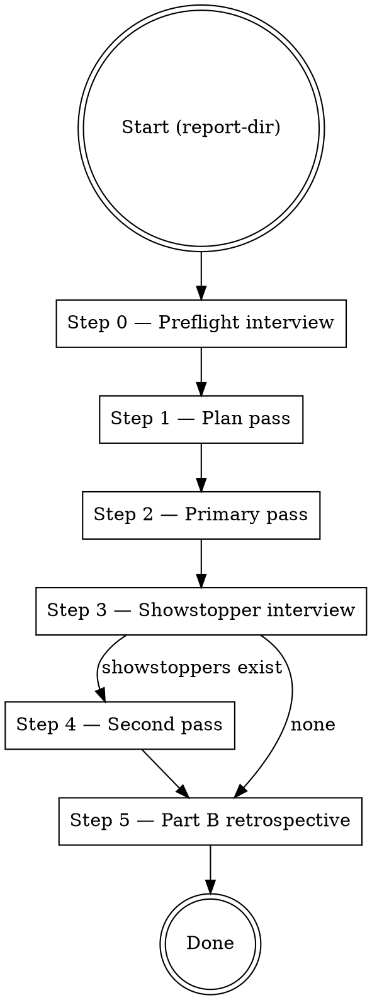

# Implement Analysis Report

## Overview

Consume a `codebase-deep-analysis` report directory and land the fixes cluster-by-cluster. A single consolidated preflight interview captures every decision the run will need — cluster subset, `needs-decision` answers, `needs-spec` handling, branch strategy, verification gates, dry-run toggle. After that, Steps 1 through 5 proceed unattended. If showstoppers surface, they are batched into a single `AskUserQuestion` after the primary pass — the run pauses there but never mid-cluster.

**Two core principles, equally important:**

1. **Every user decision lands at preflight.** The skill never prompts mid-run. If ambiguity surfaces during implementation, the affected cluster defers to the showstopper list and the run continues.
2. **The skill delegates implementation.** Per-cluster code changes are the job of `superpowers:subagent-driven-development`. iar owns preflight, planning, gate execution, revert-on-failure, frontmatter updates, `render-status.sh` invocation, and Part B.

## References (load as needed)

| File | Purpose |
|------|---------|
| `references/preflight-prompt.md` | Step 0 consolidated `AskUserQuestion` template + follow-up handling |
| `references/cluster-subagent-prompt.md` | Wrapper around `superpowers:subagent-driven-development` per cluster |
| `references/showstopper-prompt.md` | Step 3 consolidated `AskUserQuestion` template |
| `references/gate-detection.md` | Auto-detect verification gates from common build-system manifests |
| `references/cross-cluster-themes.md` | Step 2 theme detector — catches frictions that hit ≥2 clusters (mock pollution, tsc cascade, enshrined tests, etc.) |
| `references/partb-writer.md` | How to fill Part B of `analysis-analysis.md` at run completion |
| `VERSION` | Skill version string for retrospective identity |

## Compatibility

- Consumes `codebase-deep-analysis` output v3.0 or higher. Earlier report shapes lack the required cluster frontmatter fields (`Autonomy:`, `Pre-conditions:`, `informally-unblocks:`, `attribution:`). Abort at preflight with a clear message if the report predates v3.0.
- Requires `superpowers:subagent-driven-development` to be installed. If the skill is not discoverable via the harness's Skill tool, abort at preflight before any user interaction.

## Execution flow

## Step 0 — Preflight interview

See `references/preflight-prompt.md` for the full template. The step emits exactly one `AskUserQuestion` (plus at most one follow-up if the user picks `edit detected commands / gates first`). It captures:

- Cluster subset (`all` / `only: [slugs]` / `all-except: [slugs]`). **`all` auto-filters clusters in a terminal state** (`closed`, `partial`, `deferred`, `resolved-by-dep`) so resumption runs only touch clusters that still need work. The prompt shows the skipped-terminal count for transparency. To force re-attempting already-terminal clusters (e.g., to re-verify after drift), set `include-terminal: true` at preflight.
- One decision answer per `needs-decision` cluster in the subset
- Per `needs-spec` cluster: auto-defer to `docs/ideas/<slug>.md` (default) or free-text spec now
- Branch strategy: `new-branch` (default, `fix/deep-analysis-{YYYY-MM-DD}`) / `current-branch` / `worktree`. On a resumption run, `new-branch` reuses the existing branch if it already exists (e.g., `fix/deep-analysis-2026-04-21` created by session 1), and fast-forwards rather than recreating.
- Verification gates (auto-detected set, user-editable)
- Dry-run toggle (default off)
- Proceed / abort

On proceed, the skill records the decisions into its working memory and never prompts again until Step 3.

On abort (or no response within a reasonable window), exit cleanly.

## Step 1 — Plan pass

No user interaction. No code changes. The skill:

1. Parses every cluster file in the chosen subset. For each cluster extract: `Status`, `Autonomy`, `Depends-on`, `informally-unblocks`, `Pre-conditions`, `attribution`, per-cluster `gate:` override (if frontmatter carries one). Also parse TL;DR and Findings bodies.
2. Builds execution order. Topological sort on `Depends-on:` edges; within a level, cda's numeric prefix order from the filename. `informally-unblocks:` is logged but does not reorder. A cycle aborts with the cycle members listed.
3. Resolves `Pre-conditions:`. Any unmet pre-condition promotes the cluster directly to the showstopper list without attempting it.
4. Writes the plan to `{report-dir}/.scratch/implement-run.log` (JSON + human-readable summary).

## Step 2 — Primary pass

Sequential per cluster. For each cluster in plan order:

1. **Capture pre-cluster SHA** via `git rev-parse HEAD`.
2. **Dispatch per-cluster subagent** via `references/cluster-subagent-prompt.md`. The wrapper invokes `superpowers:subagent-driven-development` with cluster body + preflight-captured decision answer + needs-spec text (if any). The subagent produces code changes but does NOT commit and does NOT run gates.
3. **Run verification gates.** Per-cluster `gate:` frontmatter override wins; otherwise run the preflight baseline set. Gates timeout per `references/gate-detection.md`.
4. **On all gates passing:**
   - `git add -A`, commit with canonical message (`fix(cluster NN-slug, YYYY-MM-DD): {goal}`).
   - Commit message body includes `Incidental fixes:` section listing any files outside the cluster's named scope that were touched to pass gates, with one-line reasons from the subagent (per cda synthesis §12).
   - Flip cluster `Status: closed`, set `Resolved-in: <SHA>`.
   - Run `./scripts/render-status.sh .` from the report directory.
5. **On any gate failing OR subagent returning "cannot implement without further decision":**
   - `git reset --hard <pre-cluster-SHA>`.
   - Append `Deferred-reason:` line to the cluster frontmatter naming the failed gate (or subagent reason).
   - Add the cluster to the showstopper list with the gate's output excerpt (first 40 lines of stderr).
   - Continue with the next cluster.

If a cluster has `attribution: NN-slug (caught-by: ...)` in frontmatter, the commit message body names the attribution cluster but Status updates apply to THIS cluster only.

**Cross-cluster theme detection.** After each cluster terminates (close / partial / defer), inspect the cluster's outcome against the recognized theme shapes in `references/cross-cluster-themes.md`. Append matches to `THEMES_LOG` keyed by shape tag. Before Step 3, filter `THEMES_LOG` for shapes that hit ≥2 clusters and write each to `{report-dir}/.scratch/implement-themes.md`. Part B consumes this file in Step 5.

**Per-cluster model selection.** Before dispatching the subagent, read the cluster frontmatter's `model-hint:` field if present (`junior` / `standard` / `senior`). Pass it to the subagent dispatch's model selection. Default to `standard` when the hint is missing.

Backward compatibility: older `codebase-deep-analysis` reports may carry vendor-specific hints. Treat unknown legacy values as `standard` before dispatch and do not write legacy values back into report files.

## Step 3 — Showstopper interview

If the showstopper list is empty, skip to Step 5.

Otherwise emit exactly one `AskUserQuestion` per `references/showstopper-prompt.md`. Per showstopper, three choices: `resolve: <free-text>` / `partial: <what was done>` / `defer: <reason>`.

If the user does not respond within a reasonable window, every showstopper is treated as `defer`. The run continues to Step 5.

## Step 4 — Second pass

Only handles clusters the user chose to `resolve` in Step 3. Execution matches Step 2 with the user's new input folded into the subagent prompt. No third pass — a cluster that fails its second attempt stays `partial` with `Resolved-in: (partial — second-pass gate '{X}' still failing)`.

## Step 5 — Part B retrospective

See `references/partb-writer.md`. Opens `{report-dir}/analysis-analysis.md` and **appends a new per-session Part B section** using the data collected during the run (cluster order attempted, outcomes, timings, showstoppers, incidentals, branch strategy, gate list). Each session writes its own section with heading `## Part B — Fix coordinator retrospective (session N, YYYY-MM-DD, iar {version})`, where `N` is derived by scanning the file for existing Part B headings. The skill's own revision is captured via the fallback chain (`sha:` → `version:` → `skill-md-hash:`) so each session's retrospective is identifiable even when future iar versions differ. Never overwrites a prior session's Part B. Anonymization matches cda's Part A contract.

## Model selection

Default orchestrator model: whichever agent invokes the skill — no escalation rule. Per-cluster subagents inherit whatever `superpowers:subagent-driven-development` selects for the requested tier. The junior tier is not used for implementation; the cost savings do not justify the lower reliability on code changes.

## Common mistakes

- **Prompting mid-run.** Step 0 captures every decision. Steps 1–5 must not call `AskUserQuestion`. If ambiguity surfaces, defer the cluster to the showstopper list — do not ask.
- **Running gates before the subagent has finished.** The orchestrator owns the gate choke point; the subagent produces code only. Running gates mid-subagent is a category error.
- **Committing on subagent failure.** `git reset --hard` is mandatory on gate failure. Leaving a failed cluster's changes in the tree poisons every subsequent cluster.
- **Editing cluster findings or bodies.** The cluster file is frozen input. Only `Status:`, `Autonomy:` (rarely), `Resolved-in:`, `Deferred-reason:` are writable from this skill.
- **Promoting a `needs-spec` cluster to `closed`.** `needs-spec` defaults to auto-defer to `docs/ideas/<slug>.md`. A subagent confident it can implement a `needs-spec` cluster without a spec is misreading the autonomy field.
- **Skipping `render-status.sh`.** Every Status flip re-runs the script. The README / REPORT.md index drifts otherwise.
- **Skipping Part B.** The retrospective is the mechanism by which iar evolves. An empty or boilerplate Part B is worse than none. Write specifics while they are fresh.
- **Running a second AskUserQuestion for gate overrides.** Gate overrides per cluster live in cluster frontmatter (`gate:` field), set during cda synthesis. If a gate override is missing, inherit the preflight baseline — do not re-ask.
- **Parallel cluster execution.** Clusters run strictly sequentially. Shared working tree semantics + `Depends-on:` edges make parallelism unsafe.
- **Re-attempting already-terminal clusters silently.** `Status: closed` / `partial` / `deferred` / `resolved-by-dep` clusters auto-filter from the default `all` subset. If the user sets `include-terminal: true` at preflight, show the terminal-state clusters explicitly so the user confirms intent before the subagent re-runs on them.
- **Overwriting a prior session's Part B.** Resumption runs append a new `## Part B — Fix coordinator retrospective (session N, ...)` section. Never edit a prior session's heading or body.

## Bookkeeping after the run

- Branch (or worktree) is left for the user to review, merge, or PR. The skill does not push.
- `{report-dir}/.scratch/implement-run.log` is retained — it is the primary raw input for the next iar version's RED-phase.
- Part B of `analysis-analysis.md` is written in place.
- Cluster frontmatter reflects final state. README / REPORT.md index is regenerated.
